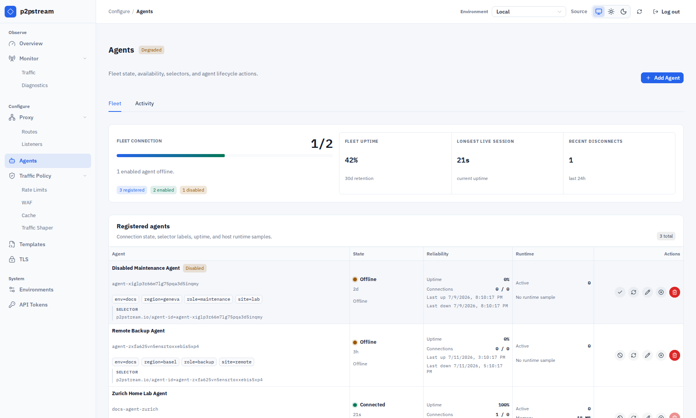
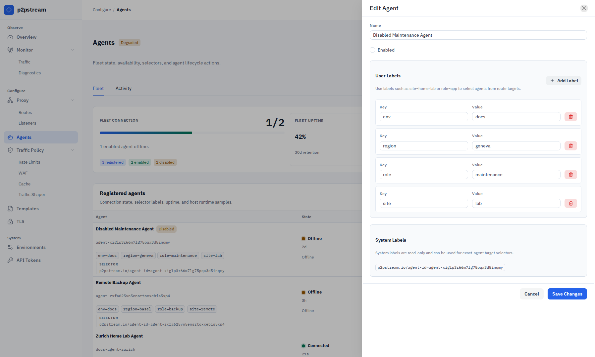

# Agents

Agents let p2pstream forward public traffic into networks that do not accept inbound connections.

## What It Is

An agent is a registered remote worker with a generated public ID and token. It connects outbound to the management server over an authenticated Yamux tunnel on management TLS, receives raw TCP stream requests, dials origins from its own network, and relays bytes back.

## When It Matters

Use agents for home lab services, private network apps, remote hosts behind NAT, or route targets that need more than one private network path.

## Runtime Behavior

Agent IDs and tokens are generated by management. Tokens are shown once when created or rotated and are stored server-side as hashes.

Agents can also carry labels. User labels are configured in the Agent editor and are used by agent route targets to select eligible agents. Labels under `p2pstream.io/` are system-owned and displayed read-only. The built-in exact-agent selector label is:

```text
p2pstream.io/agent-id=<agent public ID>
```

Agent target selectors require at least one label. All selector labels must match the same enabled agent. Empty label values are allowed, but use them intentionally because `role=` matches only agents whose `role` label is present and empty.

Agents connect outbound to management:

- HTTPS for stats and API calls.
- HTTP/1.1 upgrade streaming on `/agent/tunnel` with `Upgrade: p2pstream-yamux` for forwarding.

The tunnel runs Yamux keepalives over the upgraded management connection. If another reverse proxy sits in front of the management listener, it must allow HTTP/1.1 upgrade streaming for `p2pstream-yamux` and keep idle upgraded connections open long enough for long-lived agent sessions.

Old WebSocket agents are incompatible with this transport. Keep server and agent versions matched after the Yamux breaking change.

The **Agents** page puts enabled offline agents first, then supports search by name, ID, or label and filtering by state. The Fleet tab shows current connected or offline duration, uptime percentage over the observability retention window, connection and disconnect counts, load, and visible **Investigate** and **Edit** actions. Exact identity and selector details are collapsed until needed; lifecycle actions such as enable/disable, rotate, uninstall, and delete live in each row's **More** menu. The Activity tab shows the newest connection sessions and is filtered automatically when **Investigate** is selected. Uptime is calculated from retained `connections` rows, clipped to the retention window and the agent creation time. If the management server restarts after a crash or forced stop, stale open connection rows are closed at startup so old sessions do not appear active forever.

By default, agents reject insecure HTTP management URLs and verify HTTPS certificates. For auto-generated management TLS, pass one of:

| Variable | Use |
| --- | --- |
| `MANAGEMENT_CA_FILE` | Path to a PEM CA bundle on the agent host. |
| `MANAGEMENT_CA_PEM_BASE64` | Base64-encoded PEM CA bundle, useful for generated snippets. |

The **Agent Setup** modal can generate a one-line Linux systemd installer, a Docker Compose service, or a direct CLI command. Each generated form configures writable durable management trust; Docker uses a named state volume and direct CLI runs use a local state directory. The Linux installer downloads the release binary, verifies the checksum, writes `/etc/p2pstream/agent.env`, enables `p2pstream-agent.service`, and restarts it. After token rotation, run the generated Linux reinstall command on the existing agent host so the new token and TLS material are loaded by a fresh process.

If management requires agent client certificates, configure:

```text
AGENT_TLS_CERT_FILE=/etc/p2pstream/agent.crt.pem
AGENT_TLS_KEY_FILE=/etc/p2pstream/agent.key.pem
```

## Common Mistakes

- Reusing an old token after rotating it in management instead of running the generated reinstall command on the agent host.
- Setting `MANAGEMENT_URL` to a public listener instead of management.
- Putting management behind a reverse proxy that blocks HTTP/1.1 upgrade streaming for `p2pstream-yamux` or closes idle upgraded connections too aggressively.
- Forgetting CA material when management uses the auto-generated local CA.
- Deleting the management agent record and expecting files to be removed from the remote host.

## Related Links

- [Expose a home lab app](../guides/expose-a-home-lab-app)
- [Build a multi-agent target](../guides/agent-pool)
- [Systemd uninstall](../operations/systemd#uninstall-agent)

<figure class="doc-screenshot">
  
  <figcaption>The Fleet tab puts agents needing attention first and keeps investigation and editing visible while less frequent lifecycle actions remain in the row menu.</figcaption>
</figure>

<figure class="doc-screenshot">
  
  <figcaption>The agent drawer separates user labels used by route targets from reserved system labels such as the exact-agent selector.</figcaption>
</figure>
