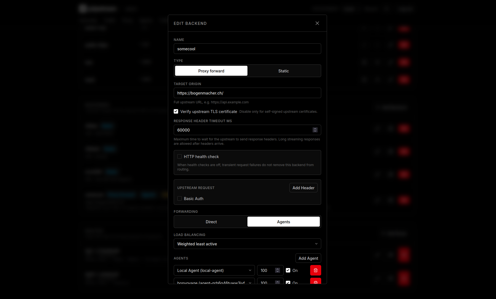
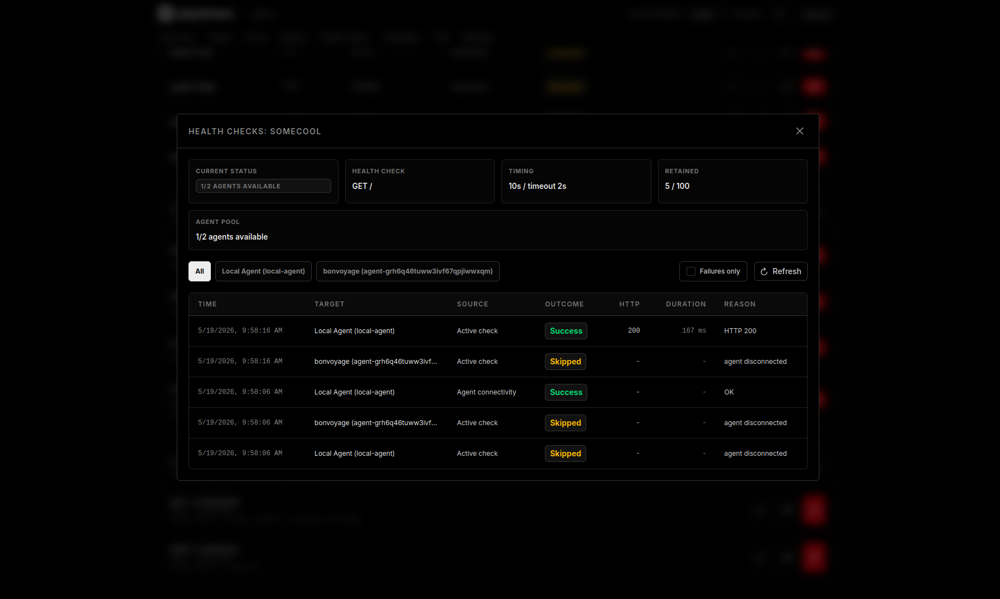

# Backends

Backends describe what happens after a route or listener default selects a destination.

## What It Is

Backends can either forward to an upstream origin or return a configured static response directly from p2pstream.

| Type | Use |
| --- | --- |
| Proxy forward | Forward the request to an upstream origin. |
| Static | Return a configured status code, headers, and body. |

Proxy-forward backends have two forward modes:

| Mode | Behavior |
| --- | --- |
| Direct | The p2pstream server connects to the upstream origin. |
| Agent pool | The server selects a connected agent and the agent connects to the upstream origin. |

## When It Matters

Backends matter when choosing whether the p2pstream server or a remote agent should reach an upstream, adding health checks, tuning first-byte timeouts, or deciding whether public asset cache can apply.

## Runtime Behavior

Proxy-forward backends have an upstream response-header timeout. The default is `60000` milliseconds. It controls how long p2pstream waits for upstream response headers; it does not limit response streaming after headers arrive.

Direct backends enforce this timeout from the p2pstream server. Agent-pool backends enforce it on the selected agent. Older agents that do not understand timeout metadata continue using their built-in `30000` ms timeout until upgraded.

Agent-pool backends support round-robin, weighted round-robin, random, weighted random, least active requests, and weighted least active requests. Assignment weights must be between `1` and `1000`.

Proxy-forward backends can define HTTP health checks:

- method `GET` or `HEAD`,
- path starting with `/`,
- interval and timeout,
- healthy and unhealthy thresholds,
- expected status range.

Direct backend health checks run from the p2pstream server. Agent-pool health checks run through each enabled assigned connected agent. When health checks are enabled, unhealthy or passively cooling-down backends/agent assignments are skipped for later requests.

Cache rules apply only to proxy-forward backends. Static backends and redirect routes are not cached.

Static response bodies can be defined inline on the backend or selected from a central generic response template. The template supplies only the body; the static backend still controls the status code and response headers such as `Content-Type`, `Cache-Control`, and `Retry-After`.

<figure class="doc-screenshot">
  
  <figcaption>The backend editor groups the forwarding mode, target origin, load-balancing policy, response-header timeout, and health-check controls that determine backend eligibility at request time.</figcaption>
</figure>

<figure class="doc-screenshot">
  
  <figcaption>Agent-pool backends expose per-agent assignment health and recent health-check logs so you can distinguish a down upstream from an offline or unhealthy agent path.</figcaption>
</figure>

## Common Mistakes

- Setting an agent-pool target origin that only the server can resolve.
- Using `tls_skip_verify` for public internet upstreams instead of fixing certificates.
- Expecting p2pstream to replay the same failed request to another backend.
- Confusing health-check timeout with upstream response-header timeout.

## Related Links

- [Publish a service](../guides/publish-a-service)
- [Build a multi-agent backend pool](../guides/agent-pool)
- [Response templates reference](../reference/response-templates)
- [Cache](./cache)
- [Routing rules reference](../reference/routing-rules)
