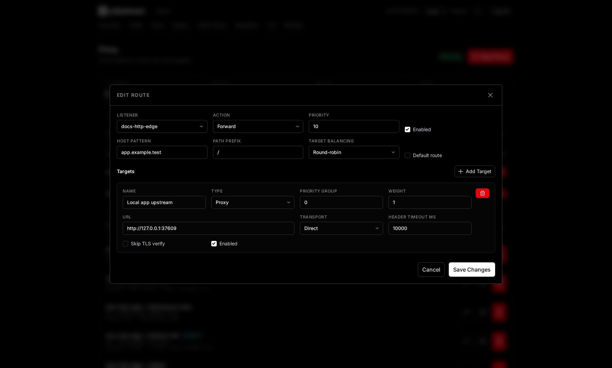
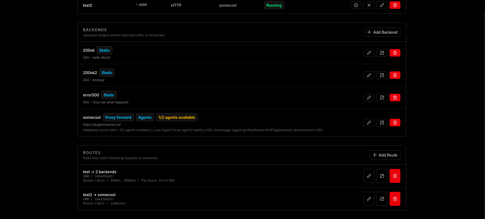

# Routing

Routes decide what a public listener does with a matching host and path after earlier policy layers have run.

## What It Is

A route belongs to one listener and performs either a forward action or a redirect action. Forward routes select one or more backends; redirect routes return a redirect response without contacting an origin.

## When It Matters

Routing matters when publishing multiple hostnames on one listener, adding path-specific backends, creating fallbacks, or explaining why a request reached the listener but not the expected backend.

## Runtime Behavior

Routes are evaluated after WAF, rate limits, and traffic shapers. Cache rules run after route/backend selection and can serve eligible proxy-forward assets without contacting the origin.

A route must include at least one of:

- host pattern,
- path prefix.

Host patterns support exact hosts such as `app.example.com` and wildcard subdomains such as `*.example.com`. Path prefixes must start with `/`.

Routes are sorted by priority, then ID. Lower priority numbers run first.

| Priority | Host | Path | Result |
| --- | --- | --- | --- |
| `10` | `app.example.com` | `/api` | checked first |
| `20` | `app.example.com` | `/` | fallback for same host |
| `100` | empty | `/` | broad listener fallback |

Forward routes can load-balance across multiple route backend assignments. Each assignment has a backend, enabled flag, position, and weight from `1` to `1000`. If all assigned backends are disabled or unavailable, the optional route fallback backend is tried. If no fallback is usable, p2pstream returns `503 Service Unavailable`.

Redirect status codes must be `301`, `302`, `307`, or `308`.

| Redirect mode | Target example | Behavior |
| --- | --- | --- |
| Same host path | `/new` | Redirects to a path on the same request host. |
| External origin keep path | `https://new.example.com` | Keeps the incoming path and query on another origin. |
| Absolute URL | `https://new.example.com/docs` | Redirects to the exact URL, with optional path/query preservation. |

<figure class="doc-screenshot">
  
  <figcaption>The route editor shows the match, action, backend pool, fallback backend, and priority in one place. Use it to verify that specific rules run before broad fallback routes.</figcaption>
</figure>

<figure class="doc-screenshot">
  
  <figcaption>The route list shows how saved routes are ordered and which backends they can select for matching requests.</figcaption>
</figure>

## Common Mistakes

- Putting broad catch-all routes at lower priority numbers than specific routes.
- Expecting the listener default backend to run when an enabled matching route exists but no assigned backend is available.
- Forgetting wildcard host patterns do not match the apex host.
- Expecting captcha or waiting-room redirects to replay request bodies.

## Related Links

- [Publish a service](../guides/publish-a-service)
- [Redirects and static responses](../guides/redirects-and-static-responses)
- [Routing rules reference](../reference/routing-rules)
