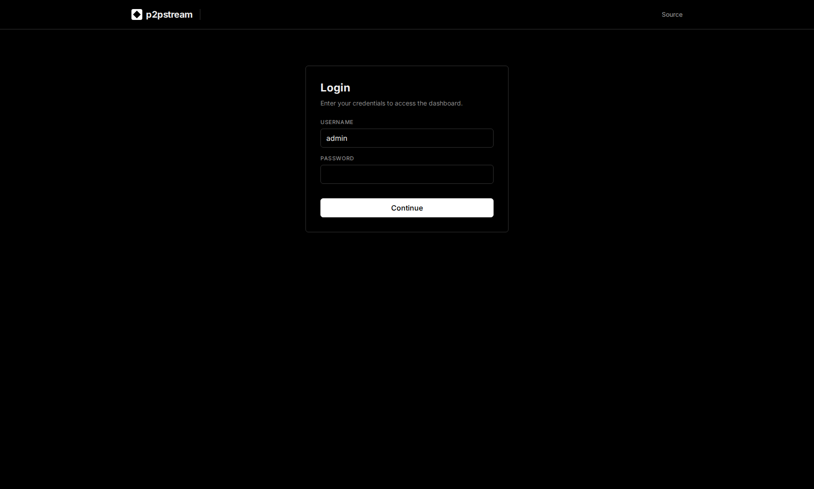

# Release Binary

Install the release binary directly on a Linux host when you do not want Docker to manage the server.

## Use This When

Use this advanced path for a systemd-managed host install, custom networking, or environments where Docker is not available. Most selfhosters should start with [Docker Compose](./quickstart).

## Prerequisites

- Linux `amd64` or `arm64`.
- A release archive and `checksums.txt` from GitHub Releases.
- The matching source archive from GitHub Releases when you need the complete corresponding source.
- A persistent data directory such as `/var/lib/p2pstream`.
- Root or equivalent privileges when binding low ports such as `80` and `443`.

## Steps

1. Download and verify the archive:

   ```bash
   curl -fLO https://github.com/Kirari04/p2pstream/releases/download/vX.Y.Z/p2pstream_vX.Y.Z_linux_amd64.tar.gz
   curl -fLO https://github.com/Kirari04/p2pstream/releases/download/vX.Y.Z/p2pstream_vX.Y.Z_source.tar.gz
   curl -fLO https://github.com/Kirari04/p2pstream/releases/download/vX.Y.Z/checksums.txt
   sha256sum -c checksums.txt --ignore-missing
   tar -xzf p2pstream_vX.Y.Z_linux_amd64.tar.gz
   ```

   Use `linux_arm64` on ARM hosts.

2. Install the binary:

   ```bash
   sudo install -m 0755 p2pstream /usr/local/bin/p2pstream
   sudo install -d -m 0700 /var/lib/p2pstream
   ```

3. Start the server for an initial test:

   ```bash
   sudo env CONFIG_DIR=/var/lib/p2pstream \
     MANAGEMENT_PUBLIC_URL=https://proxy.example.com:8081 \
     SECRETS_ENCRYPTION_KEY=replace-with-32-byte-base64-key \
     SECRETS_ENCRYPTION_KEY_ID=primary-2026-06 \
     SECRETS_ENCRYPTION_REQUIRED=true \
     /usr/local/bin/p2pstream server
   ```

   Use `SECRETS_ENCRYPTION_KEY_FILE=/etc/p2pstream/secrets-encryption.key` instead of `SECRETS_ENCRYPTION_KEY` when your secret manager can mount a `0400` or `0600` key file.
   For external key custody, use `SECRETS_ENCRYPTION_PROVIDER=vault-transit` with `SECRETS_ENCRYPTION_VAULT_ADDR`, `SECRETS_ENCRYPTION_VAULT_TOKEN_FILE`, and `SECRETS_ENCRYPTION_VAULT_KEY` instead of the direct key variables.

4. For production, create a systemd unit instead of running the foreground command.

   :::tip Production setup
   The `.env` file is optional for the binary install — environment variables can be passed directly or via a systemd `EnvironmentFile`. For a long-running server, use the [Systemd guide](../operations/systemd) to create a proper service unit with automatic restart and hardened permissions.
   :::

## Runtime Effects

`p2pstream server` reads `.env` and environment variables, starts management on `MANAGEMENT_PORT` default `8081`, loads public listeners from SQLite, and stores generated files under `CONFIG_DIR` when `DATABASE_URL` is unset.

Set stored-secret encryption in production to protect upstream/API credentials in SQLite. Use direct mode with `SECRETS_ENCRYPTION_KEY_FILE` or `SECRETS_ENCRYPTION_KEY`, or use `SECRETS_ENCRYPTION_PROVIDER=vault-transit` for Vault Transit KEK/DEK envelope encryption. For direct mode, generate the key with `p2pstream secrets generate-key`, store it outside `CONFIG_DIR`, and keep it available for restore and key rotation. Prefer the file option when your secret manager can mount a `0400` or `0600` file. For an existing plaintext deployment, start once with `SECRETS_ENCRYPTION_REQUIRED=false`, confirm startup succeeds or run `p2pstream secrets status`, then switch it to `true`.

The same binary also includes the agent command:

```bash
p2pstream agent \
  --management-url https://proxy.example.com:8081 \
  --management-ca-file /etc/p2pstream/management-ca.pem \
  --agent-id agent-... \
  --agent-token ...
```

Most agent installs should still use the generated **Agents** setup command so the ID, token, URL, and CA material match the registered agent.

The release archive includes `LICENSE`, `NOTICE`, `SOURCE.txt`, and third-party notices under `third-party/`.

## Verification

Open:

```text
https://proxy.example.com:8081
```

Then confirm **Overview** loads and **Proxy** shows any configured listeners. If you run systemd, verify:

<figure class="doc-screenshot">
  
  <figcaption>A fresh binary install starts with the same setup screen as Compose when the database has no users.</figcaption>
</figure>

<figure class="doc-screenshot">
  
  <figcaption>After setup, return to the management URL and sign in with the admin account you created.</figcaption>
</figure>

<figure class="doc-screenshot">
  
  <figcaption>The Overview page confirms the binary server is running, selected, and reporting proxy state before you install the systemd unit.</figcaption>
</figure>

```bash
sudo systemctl status p2pstream
sudo journalctl -u p2pstream -f
```

The management listener also exposes the AGPL source offer:

```text
https://proxy.example.com:8081/.well-known/p2pstream/source
```

## Troubleshooting

| Symptom | Check |
| --- | --- |
| Cannot bind `80` or `443` | Run with enough privileges, grant capabilities, or use high ports. |
| Data disappears after restart | Ensure `CONFIG_DIR` points to persistent storage. |
| Server fails to initialize secret storage | Restore the matching direct key via `SECRETS_ENCRYPTION_KEY` or `SECRETS_ENCRYPTION_KEY_FILE`, configure the old key in `SECRETS_ENCRYPTION_PREVIOUS_KEYS`, or restore Vault Transit availability and token permissions. |
| Browser warns about management TLS | Trust the generated CA or provide trusted management TLS. |
| Agents cannot verify management | Pass the generated management CA to the agent. |

## Next Steps

- [Systemd](../operations/systemd)
- [Configuration reference](../reference/configuration)
- [CLI reference](../reference/cli)
