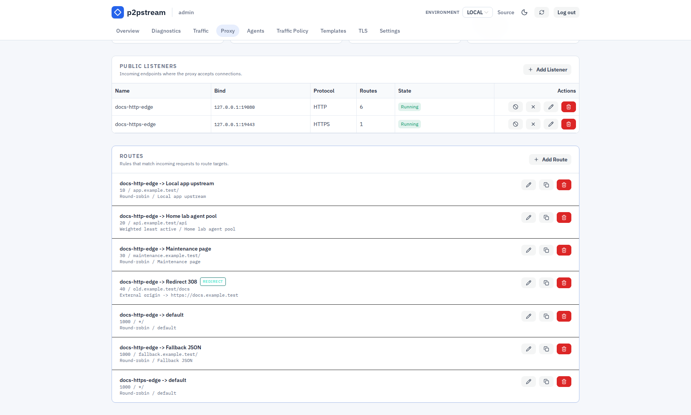

# Docker Compose Details

Run the p2pstream server container with persistent `/data`, explicit management URL settings, and only the host ports you intend to expose.

## Use This When

Use this page after the quickstart when you need to change ports, understand what the Compose file does, or operate the container lifecycle.

## Prerequisites

- The repository `compose.yaml`.
- A `.env` file copied from `.env.example`.
- A decision about which host ports should reach container ports `80`, `443`, and `8081`.

## Steps

1. Review the included root `compose.yaml`:

   ```yaml
   services:
     p2pstream:
       image: ghcr.io/kirari04/p2pstream:latest
       container_name: p2pstream
       restart: unless-stopped
       environment:
         CONFIG_DIR: /data
         MANAGEMENT_PORT: "8081"
         MANAGEMENT_UI_DISABLED: "${MANAGEMENT_UI_DISABLED:-false}"
         MANAGEMENT_PUBLIC_URL: "${MANAGEMENT_PUBLIC_URL:-https://localhost:8081}"
         MANAGEMENT_TLS_EXTRA_HOSTS: "${MANAGEMENT_TLS_EXTRA_HOSTS:-}"
         SECRETS_ENCRYPTION_KEY: "${SECRETS_ENCRYPTION_KEY:-}"
         SECRETS_ENCRYPTION_KEY_FILE: "${SECRETS_ENCRYPTION_KEY_FILE:-}"
         SECRETS_ENCRYPTION_KEY_ID: "${SECRETS_ENCRYPTION_KEY_ID:-}"
         SECRETS_ENCRYPTION_PREVIOUS_KEYS: "${SECRETS_ENCRYPTION_PREVIOUS_KEYS:-}"
         SECRETS_ENCRYPTION_REQUIRED: "${SECRETS_ENCRYPTION_REQUIRED:-false}"
       ports:
         - "${P2PSTREAM_HTTP_PORT:-80}:80"
         - "${P2PSTREAM_HTTPS_PORT:-443}:443"
         - "${P2PSTREAM_MANAGEMENT_PORT:-8081}:8081"
       volumes:
         - p2pstream-data:/data

   volumes:
     p2pstream-data:
       name: p2pstream-data
   ```

2. Set the externally reachable management URL:

   ```dotenv
   MANAGEMENT_PUBLIC_URL=https://proxy.example.com:8081
   ```

3. Add extra certificate names for auto management TLS when needed:

   ```dotenv
   MANAGEMENT_TLS_EXTRA_HOSTS=proxy.example.com,192.0.2.10
   ```

4. Enable stored secret encryption for production deployments:

   ```dotenv
   SECRETS_ENCRYPTION_KEY=replace-with-32-byte-base64-key
   SECRETS_ENCRYPTION_KEY_ID=primary-2026-06
   SECRETS_ENCRYPTION_REQUIRED=true
   ```

   Generate the key with `p2pstream secrets generate-key` and store it outside the Docker volume in your deployment secret manager. If your secret manager mounts files, set `SECRETS_ENCRYPTION_KEY_FILE` instead of `SECRETS_ENCRYPTION_KEY`. For an existing plaintext deployment, start once with `SECRETS_ENCRYPTION_REQUIRED=false`, confirm startup succeeds or run `p2pstream secrets status`, then switch it to `true`.

5. Override host ports only when the defaults are not usable:

   ```dotenv
   P2PSTREAM_HTTP_PORT=8080
   P2PSTREAM_HTTPS_PORT=8443
   P2PSTREAM_MANAGEMENT_PORT=9443
   MANAGEMENT_PUBLIC_URL=https://proxy.example.com:9443
   ```

6. Start or update the container:

   ```bash
   docker compose up -d
   docker compose logs -f p2pstream
   ```

## Runtime Effects

| Setting | Effect |
| --- | --- |
| `CONFIG_DIR=/data` | Stores SQLite, certificates, ACME state, and cache defaults in the named volume. |
| `MANAGEMENT_PORT=8081` | Makes the management UI/API and agent tunnel listener bind inside the container. Agents connect to this port for request forwarding. |
| `MANAGEMENT_PUBLIC_URL` | Controls generated links, agent snippets, and management certificate naming. |
| `MANAGEMENT_UI_DISABLED=true` | Stops serving the browser UI; ConnectRPC APIs and the agent Yamux tunnel remain available. |
| `SECRETS_ENCRYPTION_KEY` / `SECRETS_ENCRYPTION_KEY_FILE` | Encrypts stored upstream/API credentials in SQLite and rewrites existing plaintext rows on startup while required mode is off. Use only one current-key source. |
| `SECRETS_ENCRYPTION_REQUIRED=true` | Makes startup fail if a stored secret is plaintext or if encrypted rows cannot be decrypted with the configured key. |
| `P2PSTREAM_*_PORT` | Changes host-side publishing only; listener ports are still configured in p2pstream. |

:::warning New listeners must be published explicitly
Docker only exposes ports listed under `ports`. If you create an additional listener on container port `8088` in the p2pstream UI, it will bind inside the container but remain unreachable until you add it to the Compose port list and restart:

```yaml
ports:
  - "${P2PSTREAM_HTTP_PORT:-80}:80"
  - "${P2PSTREAM_HTTPS_PORT:-443}:443"
  - "${P2PSTREAM_MANAGEMENT_PORT:-8081}:8081"
  - "8088:8088"
```
:::

## Verification

Run:

```bash
docker compose ps
docker compose logs -f p2pstream
```

Then open `MANAGEMENT_PUBLIC_URL` in a browser. The **Overview** page should show proxy state, listeners, routes, targets, TLS counts, and recent traffic once requests arrive.

<figure class="doc-screenshot">
  
  <figcaption>The seeded listeners are the runtime objects behind the Compose port mappings. If you add another listener, publish that container port in Compose before expecting external traffic.</figcaption>
</figure>

## Troubleshooting

| Symptom | Check |
| --- | --- |
| Browser opens the wrong host or port | `MANAGEMENT_PUBLIC_URL` must match the external URL. |
| Agent cannot connect | Agent must reach management HTTPS/TLS and `/agent/tunnel`, not a public listener URL. |
| Extra listener is unreachable | Add a Compose port mapping for that listener port. |
| Forgot the admin password | Run `docker compose exec p2pstream p2pstream users reset-password admin`. |

## Next Steps

- [Backup and restore](../operations/backup-restore)
- [Docker reference](../reference/docker)
- [Management TLS reference](../reference/management-tls)
