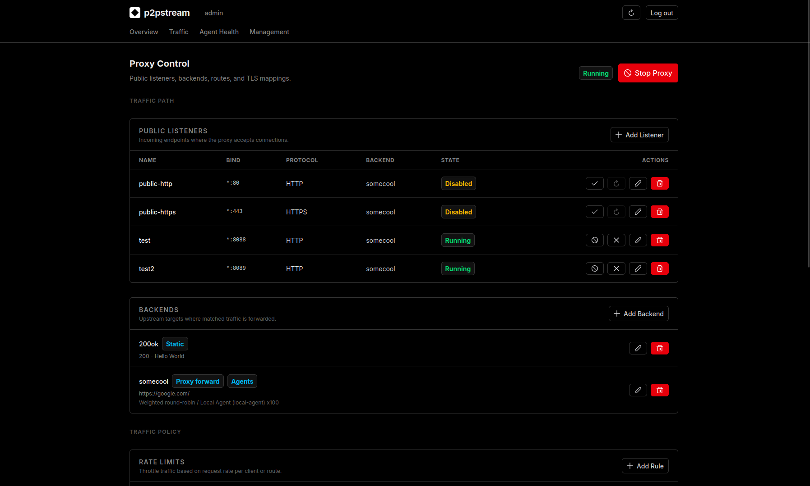

# First Login

When p2pstream starts with an empty user table, the management UI enters setup mode.

## Setup window

The first admin user can be created for 5 minutes after server start. If no user exists and the window expires, restart the server to open setup again.

This is intentionally short so an unattended public management port does not stay in setup mode indefinitely.

## Username rules

Admin usernames must be:

- 3 to 64 characters,
- lowercase letters, numbers, underscores, or hyphens,
- stored lowercase.

Examples:

```text
admin
homelab-admin
ops_1
```

## Password rules

Passwords must be at least 12 characters. Use a password manager and store the admin credential with your other infrastructure secrets.

## Sessions

Login sessions are stored in SQLite and expire after 7 days. The session cookie is:

- HTTP-only,
- SameSite Lax,
- marked Secure when `ENV=production` or `MANAGEMENT_COOKIE_SECURE=true`.

## After Login

After login, the operator lands in the management console and can move between Overview, Traffic, Agent Health, and Management.

<figure class="doc-screenshot">
  
  <figcaption>The Management tab is where listeners, backends, routes, TLS mappings, WAF rules, rate limits, and shapers are created and edited.</figcaption>
</figure>

## If you lock yourself out

Reset an existing management user's password from the host or container that can access the same database:

```bash
CONFIG_DIR=/var/lib/p2pstream p2pstream users reset-password admin
```

Docker Compose deployments store that database in the `/data` volume. Run the command with the same mounted volume or point it at the same database with `--database-url`. The reset command revokes existing sessions for that user.

If this is a new empty installation and no user was created, restart the server during the setup window.
