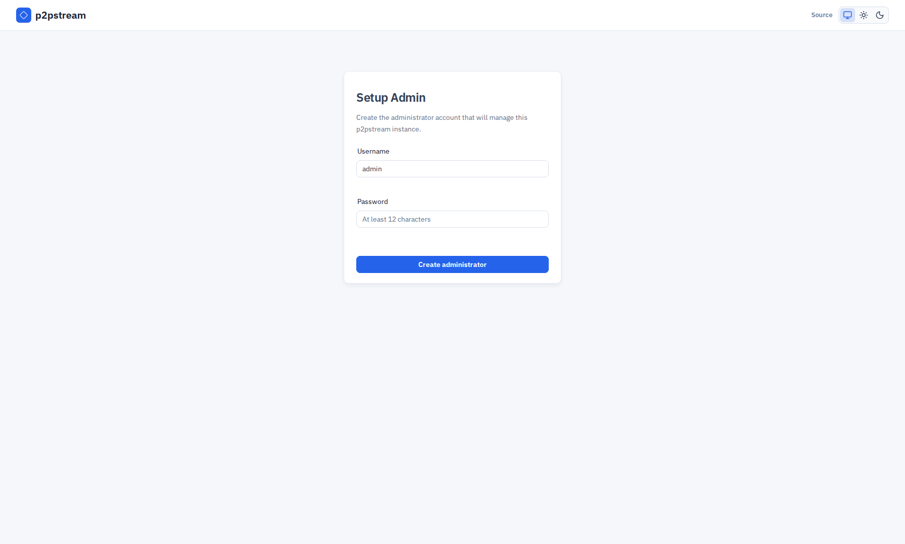

# Docker Compose Quickstart

Start p2pstream with Docker Compose, persist runtime state in the `p2pstream-data` volume, and open the management UI over HTTPS.

## Use This When

Use this path for the normal self-hosted server deployment on a VPS, home lab host, or small private fleet. Compose starts one server container with the management UI/API on `8081`, a seeded HTTP listener on `80`, and a seeded HTTPS listener on `443`.

## Prerequisites

- Linux amd64/arm64, Docker Engine with the Docker Compose plugin, Bash, curl, and Python 3.9+.
- Host ports `80`, `443`, and `8081` available, or adjusted host port mappings in `.env`.
- A management hostname or IP address that browsers and agents can reach.

## Steps

1. Download and verify the latest stable release's small Docker deployment package. The block prepares `p2pstream/compose.yaml`, a private `.env`, and `release.json`, with an immutable server image digest:

   ```bash
   (
     set -eu
     repo=Kirari04/p2pstream
     release=${P2PSTREAM_RELEASE:-$(curl --proto '=https' --proto-redir '=https' --tlsv1.2 -fsSL --connect-timeout 15 --max-time 60 "https://api.github.com/repos/$repo/releases/latest" | python3 -I -c 'import json,re,sys; v=json.load(sys.stdin)["tag_name"]; assert re.fullmatch(r"v(0|[1-9][0-9]*)\.(0|[1-9][0-9]*)\.(0|[1-9][0-9]*)(-staging\.[1-9][0-9]*)?",v); print(v)')}
     python3 -I -c 'import re,sys; assert re.fullmatch(r"v(0|[1-9][0-9]*)\.(0|[1-9][0-9]*)\.(0|[1-9][0-9]*)(-staging\.[1-9][0-9]*)?",sys.argv[1])' "$release"
     work=$(mktemp -d)
     trap 'rm -rf -- "$work"' EXIT
     trap 'exit 130' INT
     trap 'exit 143' HUP TERM
     base="https://github.com/$repo/releases/download/$release"
     asset="p2pstream_${release}_docker.py"
     curl --proto '=https' --proto-redir '=https' --tlsv1.2 -fsSL --connect-timeout 15 --max-time 120 --max-filesize 65536 "$base/checksums.txt" -o "$work/checksums.txt"
     curl --proto '=https' --proto-redir '=https' --tlsv1.2 -fsSL --connect-timeout 15 --max-time 120 --max-filesize 65536 "$base/$asset" -o "$work/$asset" || { echo "This release has no Docker deployment package. Select a newer published release containing it." >&2; exit 1; }
     python3 -I -c 'import hashlib,pathlib,re,sys; d=pathlib.Path(sys.argv[1]); n=sys.argv[2]; rows=[r.split() for r in (d/"checksums.txt").read_text().splitlines()]; hashes=[r[0] for r in rows if len(r)==2 and r[1]==n]; assert len(hashes)==1 and re.fullmatch(r"[0-9a-f]{64}",hashes[0]) and hashlib.sha256((d/n).read_bytes()).hexdigest()==hashes[0], "Deployment downloader checksum mismatch"' "$work" "$asset"
     python3 -I "$work/$asset" --repository "$repo" --release "$release" --directory "$PWD/p2pstream"
   )
   ```

   For an exact repeatable version, run `export P2PSTREAM_RELEASE=vX.Y.Z` first. Staging supports `vX.Y.Z-staging.N`. This requires a published release containing the Docker installation assets; old releases are never patched with new assets. If they are missing, choose a newer supported published release, or use an existing pinned-image deployment to upgrade manually first. GitHub and the publisher remain the trust source; checksums are not independent signatures.

2. Enter the prepared directory:

   ```bash
   cd p2pstream
   ```

3. Edit `.env` so generated browser links and agent snippets use the real management URL:

   :::warning Set the public URL before starting
   The default `MANAGEMENT_PUBLIC_URL=https://localhost:8081` only works when the browser and all agents run on the same host. Change it to the externally reachable address before first start:

   ```dotenv
   # Before (default — only works on localhost)
   MANAGEMENT_PUBLIC_URL=https://localhost:8081

   # After — use your server's real hostname or IP
   MANAGEMENT_PUBLIC_URL=https://your-server:8081
   ```
   :::

4. Start the server:

   ```bash
   docker compose up -d
   docker compose logs -f p2pstream
   ```

5. Open management:

   ```text
   https://your-server:8081
   ```

The management server uses HTTPS by default. In auto mode, p2pstream creates a local management CA and server certificate under `/data/certs/management`; browsers warn until you trust that CA or place management behind trusted TLS.

## Optional server updates

After first login, **System → Server Updates** offers a complete release-based setup block for this server. Installing the dedicated Docker-authorized updater is optional and restarts the server once. The page reconnects and confirms its availability. After enrollment, edit the same Compose inputs and `.env`, then run `sudo /etc/p2pstream-server-updater/manage apply`; use the UI for operator-triggered software updates. Read [server update operations](../operations/server-updates) before enrollment.

## Verification

The first browser visit should show **Setup Admin**. After setup, **Overview** should load. **Proxy -> Listeners** shows the seeded `public-http` and `public-https` listeners. Open their shared published Default Site under **Proxy -> Sites** to inspect its welcome route and static target. Create a separate draft Site for your application's hostnames, configure its routes inside the Site workspace, review readiness, and publish when ready.

<figure class="doc-screenshot">
  
  <figcaption>The first-run setup screen appears only before the initial admin user exists. Use the setup token from the configured environment or server startup log.</figcaption>
</figure>

Default Sites handle hostnames that no named Site owns. A published named Site keeps its own routing boundary, including when a path has no matching route. See [Sites](../reference/sites) for listener assignments, publication, and migration of older routing configurations.

On a new database, p2pstream seeds:

| Object | Default |
| --- | --- |
| HTTP listener | `public-http` on `:80` |
| HTTPS listener | `public-https` on `:443` |
| Routes | default catch-all routes with static welcome targets |
| HTTPS fallback certificate | self-signed mapping for `p2pstream.local` |

The seeded static targets serve a local `Welcome to p2pstream proxy` page. Replace them or add more specific routes before publishing real traffic.

## Troubleshooting

| Symptom | Check |
| --- | --- |
| Browser cannot connect | Confirm `docker ps`, host firewall, and `P2PSTREAM_MANAGEMENT_PORT`. |
| Certificate warning | Expected with auto management TLS until the generated CA is trusted. |
| Agent snippets use the wrong URL | Fix `MANAGEMENT_PUBLIC_URL`, then use `docker compose up -d` before updater enrollment or `sudo /etc/p2pstream-server-updater/manage apply` while enrolled. |
| Public listener does not answer | Confirm the listener exists under **Proxy -> Listeners**, is enabled and running, and its port is published by Compose. |

See [Troubleshooting](../operations/troubleshooting) for route, TLS, agent, and cache-specific checks.

## Next Steps

- [First login](./first-login)
- [Docker Compose details](./docker-compose)
- [Publish a service](../guides/publish-a-service)
