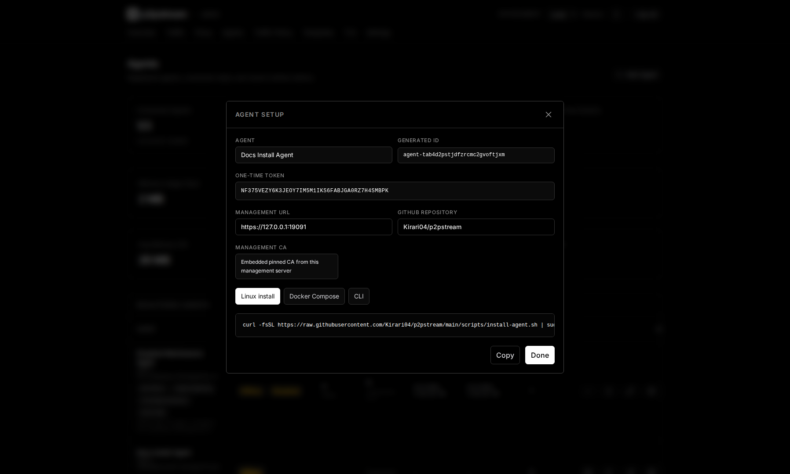
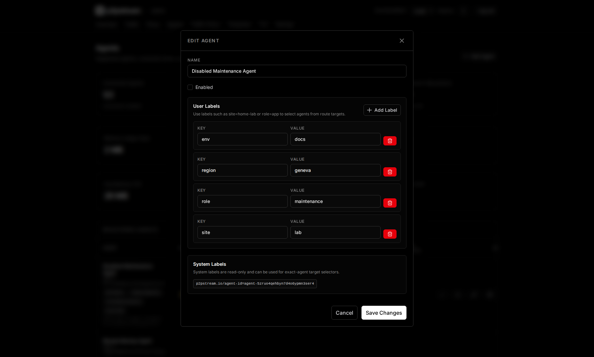
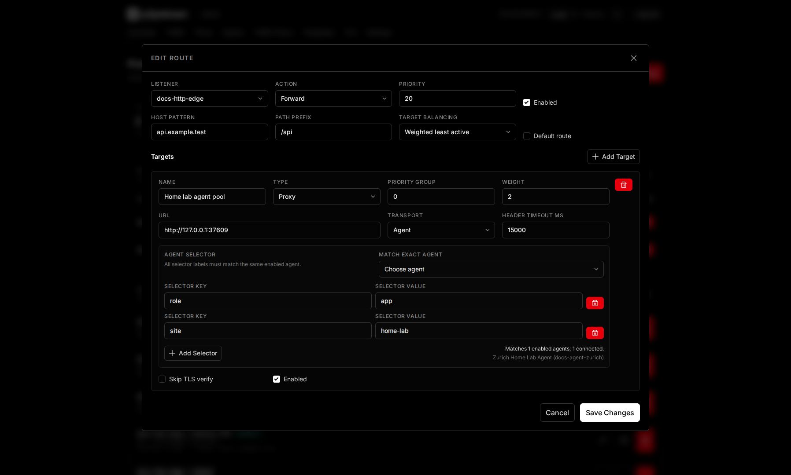

# Expose a Home Lab App Through an Agent

Expose a service from a private network by installing an agent that connects outbound to the p2pstream management server.

## Use This When

Use an agent target when the upstream service is reachable from a home lab or remote host, but not from the public p2pstream server.

Example:

| Role | Value |
| --- | --- |
| p2pstream management | `https://proxy.example.com:8081` |
| Home lab service | `http://homeassistant.local:8123` |
| Public URL | `https://ha.example.com` |

## Prerequisites

- The p2pstream server is reachable by the agent over management HTTPS/TLS and `/agent/tunnel`.
- `MANAGEMENT_PUBLIC_URL` is set to the external management URL.
- The home lab host can reach the upstream service.
- Public DNS for `ha.example.com` points to the p2pstream server.

## Steps

1. Open **Agents** and select **Add Agent**.

   | Field | Value |
   | --- | --- |
   | Name | `home-lab` |
   | Enabled | On |

   After saving, the setup dialog shows the generated `AGENT_ID` and one-time `AGENT_TOKEN`.

   <figure class="doc-screenshot">
     
     <figcaption>The setup dialog shows the one-time token and generated installer snippets. Copy the command before closing the dialog because the token is not shown again.</figcaption>
   </figure>

2. On the home lab host, run the generated Linux installer from the Agent Setup dialog. It has this shape:

   ```bash
   curl -fsSL https://raw.githubusercontent.com/Kirari04/p2pstream/main/scripts/install-agent.sh | sudo env \
     MANAGEMENT_URL='https://proxy.example.com:8081' \
     MANAGEMENT_CA_PEM_BASE64='...' \
     AGENT_ID='agent-...' \
     AGENT_TOKEN='...' \
     P2PSTREAM_REPOSITORY='Kirari04/p2pstream' \
     bash
   ```

   The installer creates `/usr/local/bin/p2pstream`, `/etc/p2pstream/agent.env`, and `p2pstream-agent.service`.

3. Check the agent service:

   ```bash
   sudo systemctl status p2pstream-agent
   sudo journalctl -u p2pstream-agent -f
   ```

4. Edit the agent and add a label in the Agent editor, for example:

   | Key | Value |
   | --- | --- |
   | `site` | `home-lab` |

   Labels under `p2pstream.io/` are system-owned and read-only. The exact-agent selector label is `p2pstream.io/agent-id=<agent public ID>`. Empty label values are allowed, but should be used only when you intentionally want to match an empty value.

   <figure class="doc-screenshot">
     
     <figcaption>Agent labels are the bridge between connected workers and agent route targets. User labels are editable; system labels are read-only and can be copied for exact-agent targeting.</figcaption>
   </figure>

5. Open **Proxy**, create or edit a forward route, and add an agent proxy target:

   :::warning Origin resolution
   The origin URL is resolved from the **agent host**, not from the p2pstream server. Set it to whatever the agent host can reach — `localhost`, a LAN hostname, or an internal IP are all valid here.
   :::

   | Field | Value |
   | --- | --- |
   | Name | `homeassistant` |
   | Type | Proxy |
   | Transport | Agent |
   | URL | `http://homeassistant.local:8123` |
   | Agent selector | `site=home-lab` |
   | Agent load balancing | Round-robin |
   | Priority group | `0` |
   | Weight | `100` |
   | Enabled | On |

   <figure class="doc-screenshot">
     
     <figcaption>The agent target editor selects agents by label and keeps the origin URL relative to the selected agent host, not the p2pstream server.</figcaption>
   </figure>

6. Configure the route match:

   | Field | Value |
   | --- | --- |
   | Listener | `public-https` |
   | Host pattern | `ha.example.com` |
   | Path prefix | `/` |

7. Open **TLS** and add an ACME certificate for `ha.example.com`.

## Verification

Run:

```bash
curl -I https://ha.example.com
```

The **Agents** page should show the agent connected, and **Traffic** tracing should show the selected route target and agent.

## Troubleshooting

| Symptom | Check |
| --- | --- |
| Agent offline | Confirm `MANAGEMENT_URL`, CA material, token, and outbound firewall access. |
| Target fails | Test `http://homeassistant.local:8123` from the agent host. |
| Health check unhealthy | Health checks run from each matching connected agent. |
| Need to remove the agent | Use the uninstall command from **Agents** or [Systemd uninstall](../operations/systemd#uninstall-agent). |

Agent selectors require at least one label, and all selector labels must match the same agent. If no label-matched agent is connected, requests to this target fail until an enabled matching agent reconnects.

## Next Steps

- [Build a multi-agent target](./agent-pool)
- [Agents](../concepts/agents)
- [Systemd operations](../operations/systemd)
