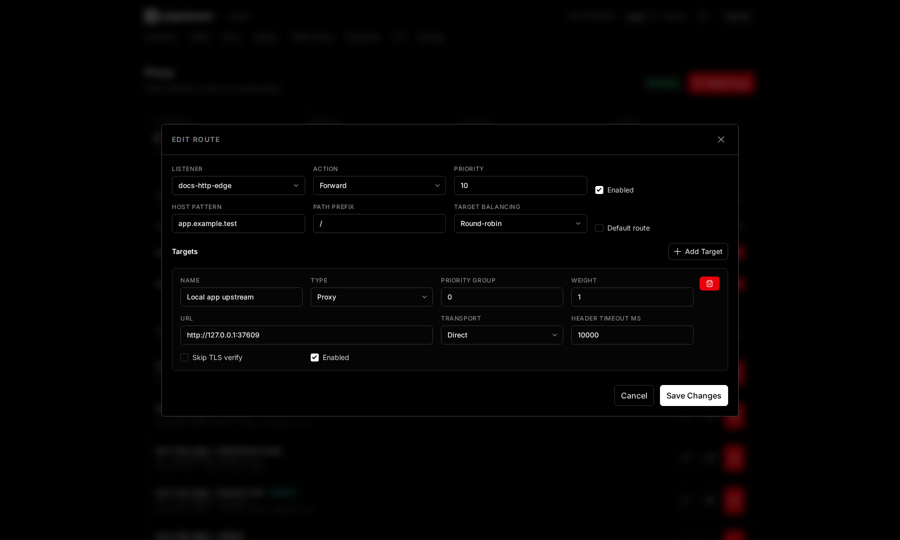
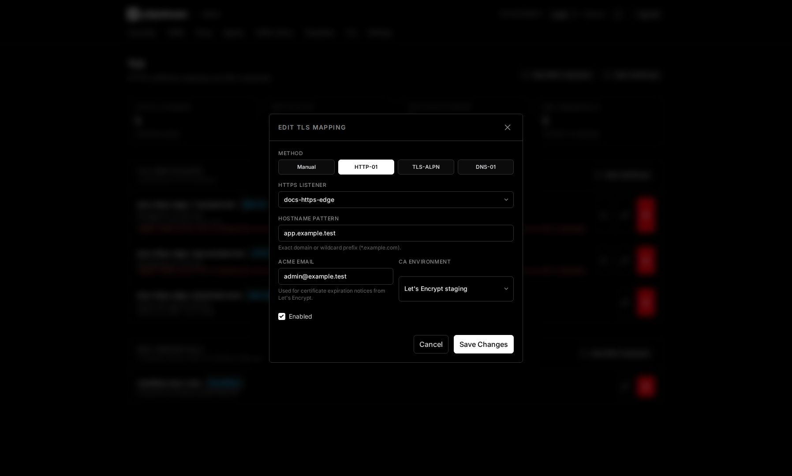
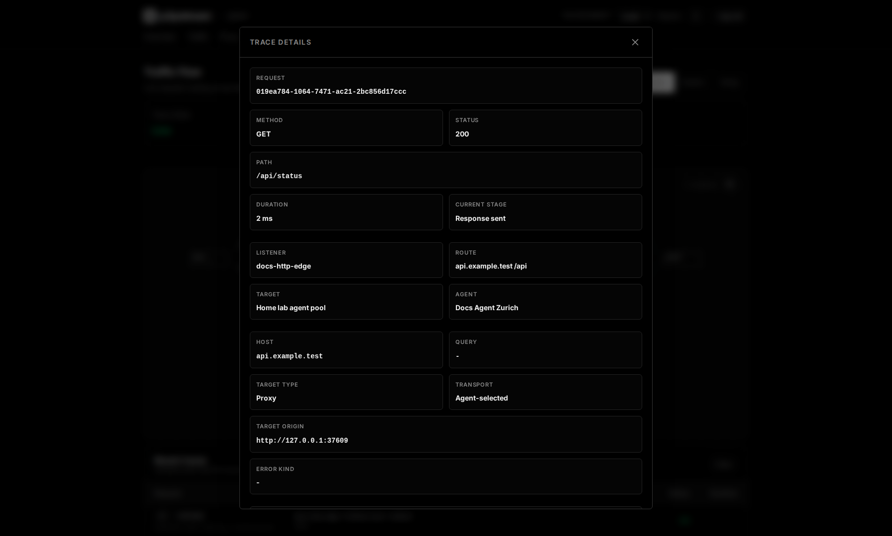

# Publish a Service with a Direct Target

Expose an upstream service that is reachable from the p2pstream server as a public HTTPS hostname.

## Use This When

Use a direct proxy target when the upstream origin is reachable from the VPS or host running p2pstream.

Example:

| Role | Value |
| --- | --- |
| Upstream origin | `https://app.internal:8443` |
| Public URL | `https://app.example.com` |

## Prerequisites

- p2pstream is running and you can log in to management.
- Public DNS for `app.example.com` points to the p2pstream host.
- The p2pstream server/container can reach `https://app.internal:8443`.
- Docker publishes `443:443` if you use the default HTTPS listener.

## Steps

1. In **Proxy**, keep or create an HTTPS listener:

   | Field | Value |
   | --- | --- |
   | Name | `public-https` |
   | Protocol | HTTPS |
   | Bind address | empty |
   | Port | `443` |
   | Enabled | On |

2. Create a route for the hostname:

   | Field | Value |
   | --- | --- |
   | Listener | `public-https` |
   | Priority | `10` |
   | Host pattern | `app.example.com` |
   | Path prefix | `/` |
   | Action | Forward |
   | Enabled | On |

3. Add a proxy target to that route:

   | Field | Value |
   | --- | --- |
   | Name | `app` |
   | Type | Proxy |
   | Transport | Direct |
   | URL | `https://app.internal:8443` |
   | Priority group | `0` |
   | Weight | `100` |
   | TLS skip verify | Off unless this is a controlled internal certificate exception |
   | Enabled | On |

   If the upstream needs custom headers, use target upstream request headers. If it needs HTTP basic auth, use target upstream basic auth instead of manually adding `Authorization`.

   <figure class="doc-screenshot">
     
     <figcaption>The direct target editor is where the server-owned upstream URL, load-balancing settings, timeout, health check, and origin TLS policy are reviewed before publishing the route.</figcaption>
   </figure>

4. Open **TLS** and add a certificate mapping for `app.example.com`.

   | Validation path | Use when |
   | --- | --- |
   | HTTP-01 | Port `80` reaches p2pstream. |
   | TLS-ALPN-01 | Port `443` reaches p2pstream. |
   | DNS-01 | You need wildcard certificates or cannot expose validation ports. |

   <figure class="doc-screenshot">
     
     <figcaption>The TLS mapping dialog binds the public hostname to the HTTPS listener and selects the ACME validation method and CA.</figcaption>
   </figure>

## Verification

Run:

```bash
curl -I https://app.example.com
```

Then check **Overview** for request counts and status classes. If you need request-stage details, open **Traffic**, enable tracing, repeat the request, and inspect the selected route target.

<figure class="doc-screenshot">
  
  <figcaption>The trace details modal confirms which route and target handled the request, whether cache was involved, and what response metadata came back from the upstream.</figcaption>
</figure>

## Troubleshooting

| Symptom | Check |
| --- | --- |
| `502 Bad Gateway` | Test the target URL from the p2pstream server/container. |
| `503 Service Unavailable` | Confirm the route has an enabled available target; check target health if health checks are enabled. |
| Fallback/self-signed certificate | Add or fix the **TLS** certificate mapping for the requested hostname. |
| Route does not match | Confirm listener, host pattern, path prefix, and priority. |

For frontend assets such as CSS, JavaScript, images, and fonts, configure public asset caching under **Traffic Policy -> Cache**. See [Public Asset Cache](../concepts/cache).

## Next Steps

- [Expose a home lab app](./expose-a-home-lab-app)
- [Routing](../concepts/routing)
- [Public TLS and ACME reference](../reference/public-tls-acme)
