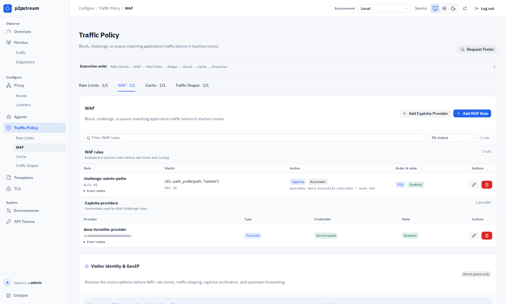
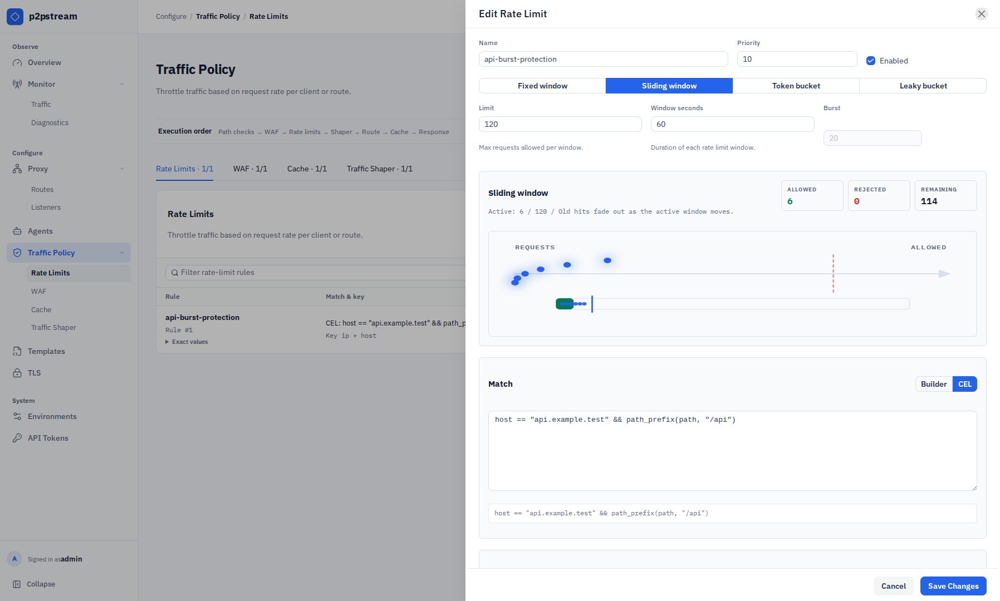

# Rate Limit a Route

Reject repeated requests before they reach route resolution and the upstream target.

## Use This When

Use rate limits for login forms, expensive API endpoints, public probes, or client budgets that should fail fast with `429`.

## Prerequisites

- A route or hostname/path you can match precisely.
- A keying strategy that identifies clients correctly in your network layout.

## Steps

1. Open **Traffic Policy -> Rate Limits** and select **Add Rate-Limit Rule**.

   <figure class="doc-screenshot">
     
     <figcaption>Rate Limits and WAF are separate Traffic Policy tabs. Both evaluate before route resolution and can reject or challenge a request before it reaches an upstream.</figcaption>
   </figure>

2. Configure the match:

   | Field | Value |
   | --- | --- |
   | Name | `login-limit` |
   | Priority | `10` |
   | Enabled | On |
   | Methods | `POST` |
   | Protocols | HTTPS |
   | Host patterns | `app.example.com` |
   | Path prefixes | `/login` |

3. Configure the algorithm. For login protection:

   | Field | Value |
   | --- | --- |
   | Algorithm | Sliding window |
   | Limit | `10` |
   | Window seconds | `60` |
   | Burst | `0` |

   For APIs that should allow short bursts, use token bucket:

   | Field | Value |
   | --- | --- |
   | Algorithm | Token bucket |
   | Limit | `120` |
   | Window seconds | `60` |
   | Burst | `240` |

4. Configure key parts. Key parts are concatenated with `|` and hashed — each unique combination gets its own counter. Default key is remote IP. Add key parts when you need a more specific budget:

   - remote IP + host,
   - remote IP + path,
   - header `Authorization` for authenticated API clients,
   - cookie or query parameter for known client identifiers.

5. Configure the response:

   | Field | Value |
   | --- | --- |
   | Status | `429` |
   | Content type | `text/plain; charset=utf-8` |
   | Body source | Inline |
   | Body | `Rate limit exceeded` |

   To reuse the same denial body across rules, open **Templates**, create a **Generic body** template, then set the rate-limit response body source to **Template** and select it. The rate-limit rule still controls the response status, content type, generated rate-limit headers, and custom response headers.

<figure class="doc-screenshot">
  
  <figcaption>The rate-limit drawer combines its algorithm preview, match, client key, request budget, and denied response so the complete rule can be reviewed before saving.</figcaption>
</figure>

## Verification

Send repeated matching requests and watch **Overview -> Problem Signals** or **Monitor -> Traffic** tracing. A limited request should return `429` and should not reach route/target selection.

## Troubleshooting

| Symptom | Check |
| --- | --- |
| Every user is limited together | p2pstream may see one reverse-proxy IP; add key parts or place p2pstream at the edge. |
| Rule never fires | Confirm method, protocol, host pattern, path prefix, and priority. |
| Bursts are too large | Burst cannot exceed 10x limit and should be set intentionally. |
| Template option rejected | Rate-limit responses can only use generic body templates. |

## Next Steps

- [Limits and shaping](../concepts/limits-and-shaping)
- [Response templates reference](../reference/response-templates)
- [Rate limits reference](../reference/rate-limits)
- [Trace live traffic](./trace-live-traffic)
