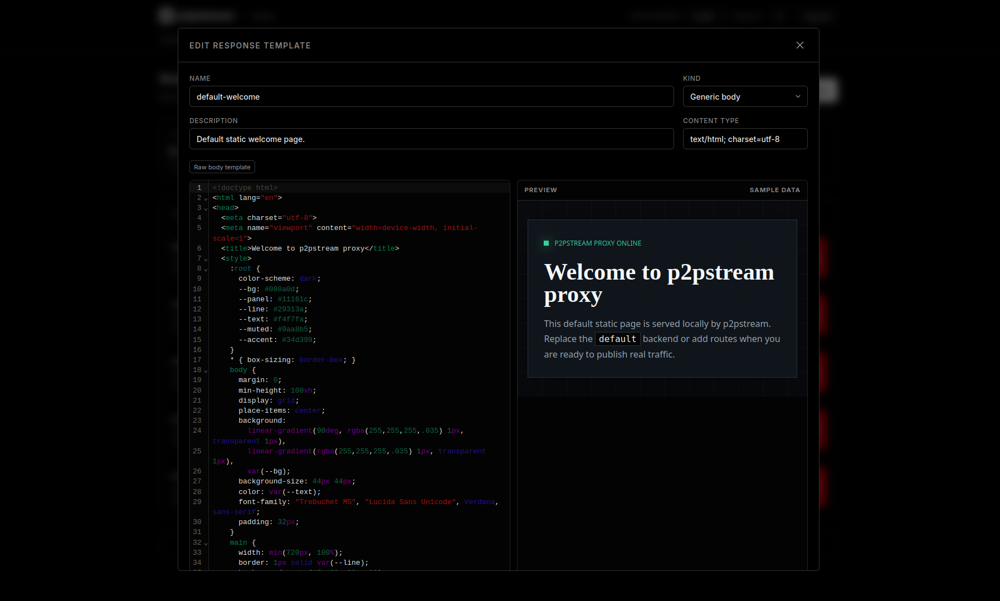

# Redirects and Static Responses

Return redirects or fixed local responses without forwarding the request to an upstream service.

## Use This When

Use redirects for host/path migrations. Use static responses for maintenance pages, health probes, or deliberate sink routes.

## Prerequisites

- A listener that receives the public request.
- A clear host/path match so the redirect or static route does not catch unrelated traffic.

## Steps

1. To redirect a whole host, open **Proxy -> Routes** and create:

   | Field | Value |
   | --- | --- |
   | Listener | `public-https` |
   | Priority | `10` |
   | Host pattern | `old.example.com` |
   | Path prefix | `/` |
   | Action | Redirect |
   | Redirect mode | External origin keep path |
   | Redirect target | `https://new.example.com` |
   | Status | `308` |
   | Preserve query | On |

   This sends:

   ```text
   https://old.example.com/docs?a=1 -> https://new.example.com/docs?a=1
   ```

2. To redirect a path on the same host, use same-host path mode:

   | Field | Value |
   | --- | --- |
   | Host pattern | `app.example.com` |
   | Path prefix | `/old` |
   | Redirect mode | Same host path |
   | Redirect target | `/new` |
   | Status | `302` |

3. To serve a static maintenance response, open **Proxy -> Backends** and create:

   | Field | Value |
   | --- | --- |
   | Name | `maintenance` |
   | Type | Static |
   | Status code | `503` |
   | Body source | Inline |
   | Response body | `Maintenance in progress` |
   | Header | `Retry-After: 300` |

   For reusable HTML maintenance pages, first open **Templates**, create a **Generic body** template, then set the static backend body source to **Template** and select it. Keep response headers, especially `Content-Type`, on the static backend.

   <figure class="doc-screenshot">
     
     <figcaption>Generic response templates centralize reusable bodies for static backends, rate-limit responses, and WAF block responses while each caller keeps control of status and headers.</figcaption>
   </figure>

4. Add a route to that static backend with a lower priority number than the normal app route:

   | Field | Value |
   | --- | --- |
   | Priority | `1` |
   | Host pattern | `app.example.com` |
   | Path prefix | `/` |
   | Backend | `maintenance` |

## Verification

Run:

```bash
curl -I https://old.example.com/docs?a=1
curl -i https://app.example.com/
```

Redirect routes should return `301`, `302`, `307`, or `308`. Static routes should return the configured status, body, and headers.

## Troubleshooting

| Symptom | Check |
| --- | --- |
| Redirect target rejected | Same-host targets must be root-relative paths; external-origin targets must be HTTP/HTTPS origins. |
| Wrong route wins | Lower priority numbers run first. |
| Static route affects all traffic | Narrow host/path match or disable the route after maintenance. |
| Template option rejected | Static backends can only use generic body templates. |

## Next Steps

- [Routing](../concepts/routing)
- [Response templates reference](../reference/response-templates)
- [Routing rules reference](../reference/routing-rules)
- [Troubleshooting](../operations/troubleshooting#route-does-not-match)
