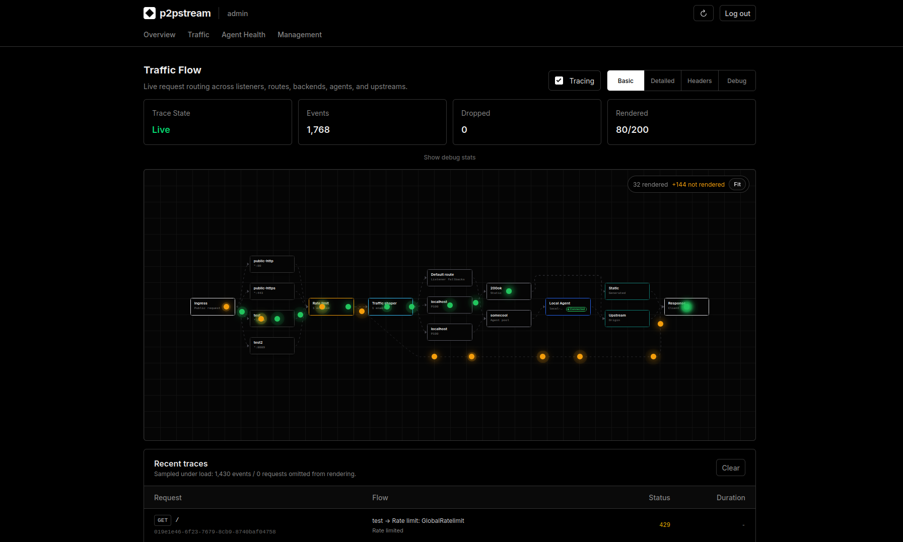

# Trace Live Traffic

Traffic tracing shows how a live request moves through listener, route, backend, agent, and upstream stages.

## 1. Open Traffic

Open **Traffic** in the management UI.

Enable **Tracing**.

<figure class="doc-screenshot">
  
  <figcaption>With tracing enabled, the Traffic view shows how sampled requests move through policy, routing, backend selection, agents, and upstreams.</figcaption>
</figure>

## 2. Select a level

| Level | Use |
| --- | --- |
| Basic | Confirm requests are received and completed. |
| Detailed | Diagnose route/backend/agent selection. |
| Headers | Inspect selected request/response headers. |
| Debug | Temporary deep troubleshooting. |

Use Headers and Debug only while diagnosing. Turn tracing off when finished.

## 3. Reproduce the request

From another shell:

```bash
curl -v https://app.example.com/api/health
```

Watch for stages:

- received,
- route resolved,
- backend selected,
- agent selected when using an agent pool,
- upstream started,
- upstream responded,
- response sent,
- failed or rate limited.

## 4. Use the diagram

The Traffic page renders recent requests across listeners, routes, backends, agents, and upstreams. Select a request to inspect details.

If the request does not appear, check that:

- tracing is enabled,
- you are hitting a p2pstream public listener,
- the browser or client is not using cached redirects,
- the listener port is published and reachable.
