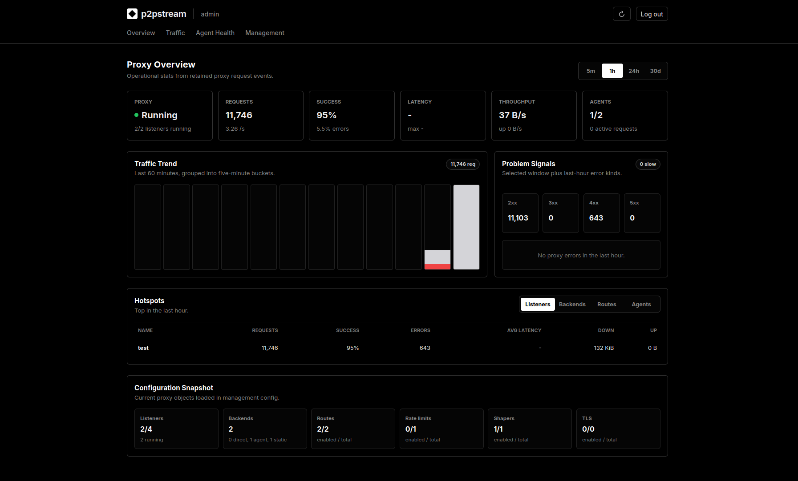

# p2pstream Self-Hosting Docs

Run p2pstream as a self-hosted public reverse proxy with a management console, optional remote agents, TLS automation, WAF controls, rate limits, traffic shaping, public asset caching, and live traffic tracing.

Start by outcome

  

    <h3>Install the server</h3>
    
Start the Docker Compose deployment, persist runtime state in <code>p2pstream-data</code>, and open management over HTTPS.

    <a href="./getting-started/quickstart">Use the quickstart</a>
  

  

    <h3>Create the first admin</h3>
    
Use the 5 minute setup window, learn the login rules, and recover with the local password reset command if needed.

    <a href="./getting-started/first-login">Complete first login</a>
  

  

    <h3>Expose an app from the server</h3>
    
Create a backend, listener, route, and TLS mapping for a service reachable from the p2pstream host.

    <a href="./guides/publish-a-service">Publish a direct backend</a>
  

  

    <h3>Expose a home lab app</h3>
    
Register an agent, install it on the remote host, and route public traffic through the outbound agent connection.

    <a href="./guides/expose-a-home-lab-app">Use an agent</a>
  

  

    <h3>Set up public TLS</h3>
    
Use ACME HTTP-01, TLS-ALPN-01, or Cloudflare DNS-01 for trusted public certificates.

    <a href="./concepts/tls">Choose a TLS path</a>
  

  

    <h3>Harden and operate</h3>
    
Restrict management access, back up <code>/data</code>, plan upgrades, and troubleshoot failed routes, TLS, agents, and cache rules.

    <a href="./operations/security-hardening">Review operations</a>
  

## What You Run

  

    <strong>Server</strong>
    Management UI/API on <code>8081</code> plus public listeners stored in SQLite.
  

  

    <strong>Data</strong>
    SQLite, generated management TLS, public TLS, ACME state, and cache files under <code>/data</code>.
  

  

    <strong>Agents</strong>
    Outbound HTTPS/WSS clients that forward selected public traffic from remote networks.
  

## Management Console

The management UI is where selfhosters inspect runtime health and manage agents, listeners, backends, routes, TLS, WAF rules, rate limits, cache rules, traffic shapers, and live traces.

<figure class="doc-screenshot">
  
  <figcaption>Overview summarizes proxy health, recent traffic, active agents, and loaded public proxy configuration.</figcaption>
</figure>

## Reading Order

1. [Docker Compose quickstart](./getting-started/quickstart)
2. [First login](./getting-started/first-login)
3. [Publish a service](./guides/publish-a-service)
4. [Expose a home lab app through an agent](./guides/expose-a-home-lab-app)
5. [TLS](./concepts/tls)
6. [Security hardening](./operations/security-hardening)
7. [Backup and restore](./operations/backup-restore)
8. [Troubleshooting](./operations/troubleshooting)

## Fast Reference

| Need | Open |
| --- | --- |
| Environment variables | [Configuration reference](./reference/configuration) |
| CLI commands | [CLI reference](./reference/cli) |
| Docker image and ports | [Docker reference](./reference/docker) |
| Route matching behavior | [Routing rules reference](./reference/routing-rules) |
| WAF, rate limits, shapers, cache | [Traffic controls](./concepts/limits-and-shaping) |
| Visual tour | [Screenshots](./reference/screenshots) |
