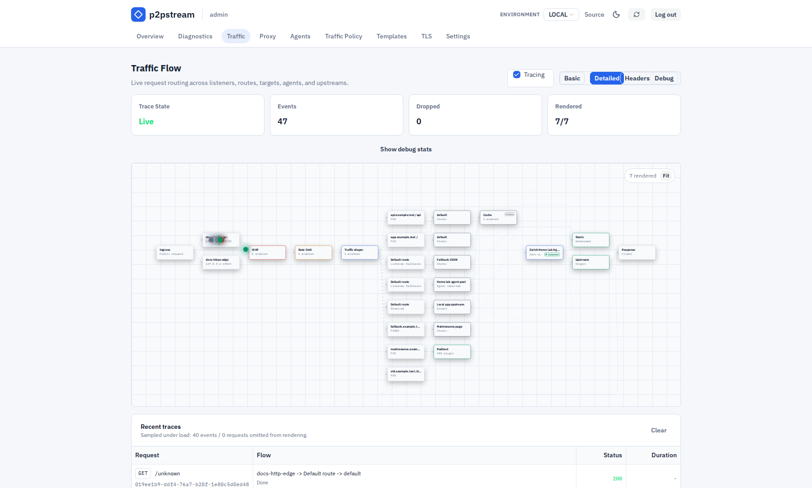
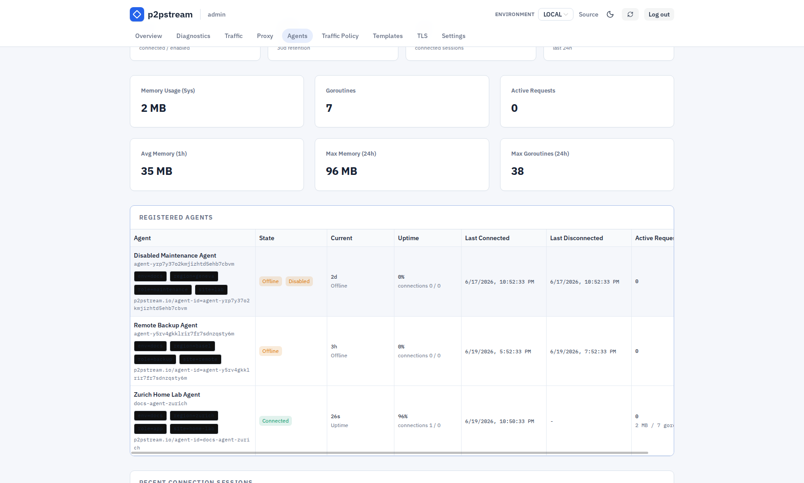
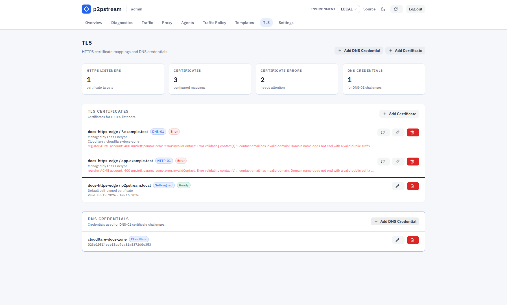

# Troubleshooting

Diagnose management, agent, listener, TLS, route, target, WAF, rate-limit, cache, and trace problems from the same operational checklist.

## Use This When

Use this when a request fails, management does not load, an agent will not connect, ACME is stuck, or a traffic policy behaves unexpectedly.

## Prerequisites

:::tip Start with logs
Logs show startup errors, TLS failures, agent connection problems, and target forwarding errors faster than any other check.
:::

Start with logs:

```bash
docker compose logs -f p2pstream
```

For systemd installs:

```bash
sudo journalctl -u p2pstream -f
sudo journalctl -u p2pstream-agent -f
```

When diagnosing public traffic, open **Traffic**, enable tracing, reproduce the request, and then turn tracing off.

<figure class="doc-screenshot">
  
  <figcaption>Use the Traffic flow view while reproducing a request to see which stage handled, rejected, cached, or failed the request.</figcaption>
</figure>

<figure class="doc-screenshot">
  
  <figcaption>The trace details modal is the fastest way to inspect route matching, selected target, cache outcome, agent selection, upstream timing, and response status for a single request.</figcaption>
</figure>

## Management UI Will Not Open

| Check | Fix |
| --- | --- |
| Container or service running | `docker ps` or `systemctl status p2pstream`. |
| Port published | Publish `8081:8081` or use the actual host port. |
| Scheme | Use `https://host:8081` unless management TLS is explicitly off. |
| Firewall | Allow the management port from your admin network. |
| Browser UI disabled | If `MANAGEMENT_UI_DISABLED=true`, the browser UI intentionally returns `404`; APIs and the agent Yamux tunnel remain available. |

## Server Fails During Startup

| Cause | Fix |
| --- | --- |
| Invalid secrets-encryption key | `SECRETS_ENCRYPTION_KEY` must decode to exactly 32 bytes as base64 or base64url. Generate one with `openssl rand -base64 32`. |
| Encrypted database rows but no key | Restore the same `SECRETS_ENCRYPTION_KEY` used when the rows were encrypted. |
| Missing previous key during rotation | Add the old key to `SECRETS_ENCRYPTION_PREVIOUS_KEYS` as `key_id:key`, restart, and keep it until startup rewraps old rows. |
| Plaintext row with required mode | Disable `SECRETS_ENCRYPTION_REQUIRED` for the first migration startup, or remove the unexpected plaintext row after confirming it was not injected. |
| Encrypted secret authentication failed | Confirm the database and key material came from the same backup set; copied ciphertext from another row, wrong key material, or corruption will fail closed. |

## Browser Certificate Warning

| Cause | Fix |
| --- | --- |
| Auto-generated management TLS | Trust the generated CA or provide your own certificate. |
| Wrong hostname | Set `MANAGEMENT_PUBLIC_URL` and `MANAGEMENT_TLS_EXTRA_HOSTS`, then restart if needed. |
| Management behind another proxy | Terminate trusted TLS at that proxy or pass the correct public URL to agents. |

## Cannot Log In

| Cause | Fix |
| --- | --- |
| Wrong or forgotten password | Reset it with `p2pstream users reset-password USERNAME` against the same database. |
| Setup window expired and no users exist | Restart the server to reopen the 5 minute setup window. |
| Reset command used the wrong database | Run it with the same `CONFIG_DIR` as the server or pass `--database-url`. |

## Agent Will Not Connect

| Check | Fix |
| --- | --- |
| `MANAGEMENT_URL` | It must point to management, usually `https://host:8081`. |
| CA trust | Use `MANAGEMENT_CA_FILE` or `MANAGEMENT_CA_PEM_BASE64` for auto TLS. |
| Token | Rotate the token and run the generated Linux reinstall command on the agent host. |
| Agent ID | Use the generated `agent-...` public ID. |
| Firewall/NAT | Agent host must reach management HTTPS/TLS and `/agent/tunnel`. |
| Insecure URL | HTTP requires `AGENT_ALLOW_INSECURE_MANAGEMENT=true`, intended for development only. |

<figure class="doc-screenshot">
  
  <figcaption>The Agents page shows whether an agent is connected, offline, disabled, recently disconnected, or missing recent connection history.</figcaption>
</figure>

## Public Listener Fails To Bind

| Cause | Fix |
| --- | --- |
| Port already used | Stop the other service or choose another listener port. |
| Missing Docker publish | Add `host:container` port mapping and restart the container. |
| Privileged port with non-root user | Run with enough privileges or bind a high port. |
| Bind address not present | Use an empty bind address or a real local address. |

## HTTPS Serves Fallback/Self-Signed Certificate

| Cause | Fix |
| --- | --- |
| No matching certificate mapping | Add a mapping for the exact host or wildcard in **TLS**. |
| ACME certificate not ready | Check certificate status, last attempt, last error, and next renewal or retry time in **TLS**. |
| Request SNI mismatch | Test with the real hostname, not the IP address. |
| Listener not restarted | Stop/start the listener or wait for automatic restart after certificate issuance. |

<figure class="doc-screenshot">
  
  <figcaption>The TLS page shows whether the requested hostname has a matching certificate mapping, whether ACME is ready, and which listener owns the mapping.</figcaption>
</figure>

## ACME Fails

| Check | Fix |
| --- | --- |
| Public DNS | Run `dig +short <hostname>` — it must return the p2pstream server's public IP. |
| HTTP-01 | Port `80` must reach the HTTP listener. Verify with `curl -I http://<hostname>/.well-known/acme-challenge/test` from an external host. |
| TLS-ALPN-01 | Port `443` must reach the HTTPS listener. |
| DNS-01 | Cloudflare zone ID and API token must be valid and enabled. |
| Wildcard | Use DNS-01; HTTP-01 and TLS-ALPN-01 do not support wildcard issuance. |
| CA | Test with staging before production. |

ACME renewal logs use `component=public_acme`. Filter those entries and inspect `cert_id`, `hostname`, `challenge_type`, `ca`, `trigger`, `stage`, `attempt_at`, `duration`, `next_renewal_at`, and `retry_at`. A successful attempt logs `ACME certificate renewal succeeded`; a failed attempt logs `ACME certificate renewal failed` with the failed stage and retry time. Failed renewals retry automatically after 1 hour.

## Route Does Not Match

| Check | Fix |
| --- | --- |
| Listener | Route must belong to the listener receiving the request. |
| Host pattern | Use exact host or `*.example.com`. |
| Path prefix | Prefix must start with `/`. |
| Priority | Lower numbers win. Put specific routes first. |
| Default route | If no explicit route matches, the listener default route handles the request. |

## Target Returns Bad Gateway

| Cause | Fix |
| --- | --- |
| Direct target origin unreachable | Run `curl -I http://<origin-host>:<port>` from inside the p2pstream container: `docker compose exec p2pstream curl -I http://app:8080`. |
| Agent target origin unreachable | SSH to a label-matched agent host and run `curl -I http://<origin-host>:<port>` to confirm the agent can reach the service from its network. |
| Agent offline | Reconnect or enable a label-matched agent. |
| Origin TLS error | Fix the origin certificate; use `tls_skip_verify` only as a temporary workaround for internal self-signed certs. |
| Wrong target origin | Include scheme and host, for example `http://app:8080`. |
| Passive health cooldown | If health checks are enabled, recent connect or timeout failures can temporarily remove the target or selected target-agent path from routing. |

Client cancellations reported as `context canceled` do not create passive health cooldowns. Real upstream timeouts, agent disconnects, and transport failures can still create cooldowns when target health checks are enabled.

When health checks are disabled, transient upstream failures fail only the current request and should not cause `no_route_target_available`.

## Target Returns Gateway Timeout

| Cause | Fix |
| --- | --- |
| Origin is slow to send response headers | Increase the target response-header timeout. The default is `60000` ms. |
| Agent target waits on a private app | SSH to a label-matched agent host and test `curl -I http://<origin>` with a long timeout (`--max-time 65`) to confirm the service responds. Raise the target timeout if it does. |
| Health check timeout confusion | Health-check timeout is separate from the response-header timeout and does not affect request serving. |
| Old agent binary | Upgrade agents and servers together; old WebSocket agents are incompatible with the Yamux tunnel transport. |

The target response-header timeout limits only the wait for first upstream headers. It does not cap the duration of streaming a response after headers are received.

## Agent Tunnel Disconnects

| Cause | Fix |
| --- | --- |
| Management reverse proxy blocks upgrades | Ensure the proxy allows HTTP/1.1 upgrade streaming for `p2pstream-yamux` on `/agent/tunnel`. |
| Idle upgraded-connection timeout is too low | Set the management proxy idle timeout high enough for long-lived Yamux tunnel sessions. |
| Keepalive failures | Check network reachability between the agent host and management URL; tunnel failures disconnect the agent so it can reconnect cleanly. |

## Agent Uptime Looks Wrong

| Cause | Fix |
| --- | --- |
| Retention window changed | Uptime percentages use retained management connection history, not all-time history. Check the dashboard retention window. |
| Agent record is new | The observation window starts at the later of retention start or agent creation time. New agents do not include time before they existed. |
| Server restarted after an unclean exit | Startup closes stale open connection rows and marks affected agents disconnected at that startup time. This prevents old sessions from looking active forever. |
| Agent is offline | The Agents page shows current offline duration from the last recorded disconnect time. |
| Missing historical rows | Uptime is based on local management `connections` data. Deleted or expired rows cannot be reconstructed from agent self-reporting. |

## Static Asset Is Not Cached

| Cause | Fix |
| --- | --- |
| No matching cache rule | Check host, path prefix, suffix, method, route/target filters, and priority. |
| Browser sends cookies | Enable `Cache requests with Cookie headers` only on precise public asset rules. |
| Authorization header present | Authorization requests always bypass cache. |
| Origin sends `Set-Cookie` | p2pstream will not store the response. |
| Origin sends `private`, `no-store`, or `no-cache` | p2pstream respects the origin denial. |
| Origin sends `Vary: Cookie`, `Vary: Authorization`, or `Vary: *` | p2pstream will not store the response. |
| Origin sends `Vary: Accept-Encoding` | This is supported; it creates separate variants. |
| Status or object size not allowed | Adjust rule status codes or max object size if appropriate. |

## Rate Limits Affect Every User

| Cause | Fix |
| --- | --- |
| p2pstream sees one proxy IP | Place p2pstream at the edge, use `REMOTE_IP` when it reflects the client, or add host/path/method/application-header key parts. Do not key on client-supplied forwarding headers. |
| Rule too broad | Add host/path/method matchers. |
| Priority conflict | Move specific rules to lower priority numbers. |

## WAF Blocks, Challenges, Or Queues Unexpectedly

| Cause | Fix |
| --- | --- |
| Rule too broad | Narrow the WAF match by host, path, method, header, cookie, or query parameter. |
| Priority conflict | Lower priority numbers win. Adjust priorities or matches. |
| Captcha provider unavailable | Confirm the provider is enabled and site key/secret key match upstream configuration. |
| Waiting room stays active | Check trigger thresholds, active request counts, server CPU, and agent CPU in the dashboard. Use `0` to disable an automatic signal. |
| All clients share one queue identity | Use `REMOTE_IP` when p2pstream sees the client address, or use trusted application-header key parts. Avoid client-controlled forwarding headers; trusted-proxy parsing is not available yet. |
| Large form or upload must be retried | Captcha and waiting-room admission use `303` redirects and do not replay request bodies. |

## Trace Stream Reconnects

| Cause | Fix |
| --- | --- |
| Management connection interrupted | Check browser network and management logs. |
| Server restarted | Reopen **Traffic** after restart. |
| Too much trace volume | Use Basic or Detailed level and clear old traces. |
| Auth session expired | Log in again. |

## Verification

After applying a fix, rerun the exact failing request, check **Overview** status classes, and use **Traffic** tracing only long enough to confirm the request path.

## Next Steps

- [Trace live traffic](../guides/trace-live-traffic)
- [Routing rules reference](../reference/routing-rules)
- [Cache reference](../reference/cache)
