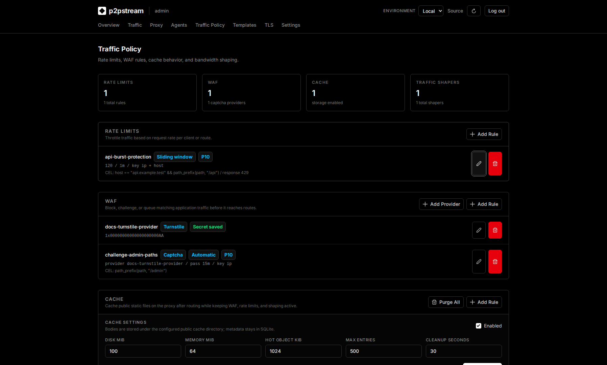
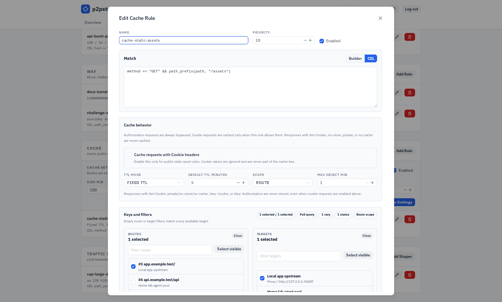

# Cache Reference

Cache rules are global public proxy policy rules for public static assets.

## Exact Fields And Defaults

Cache rules run after route/target selection and before forwarding a cache miss upstream.

| Field | Default | Description |
| --- | --- | --- |
| `name` | operator value | Rule label. |
| `priority` | `100` in database defaults | Lower numbers evaluate first. |
| `enabled` | `true` | Disabled rules are ignored. |
| `match_rule` | empty | Request-only CEL match rule. Empty matches every request. |
| `route_ids` | empty | Optional route filter. |
| `target_ids` | empty | Optional route target filter. |
| `scope` | selected target | Isolate by selected target or route. |
| `ttl_mode` | `fixed` | `fixed` or `origin`. |
| `ttl_millis` | `3600000` | Rule TTL, or origin-TTL fallback. |
| `query_mode` | full query | `full`, `ignore`, `allowlist`, or `denylist`. |
| `query_params` | empty | Query names used by allowlist or denylist modes. |
| `vary_headers` | `Accept-Encoding` | Request headers included in the cache key. |
| `cache_status_codes` | `200`, `203`, `204`, `301`, `308` | Statuses that may be stored. |
| `max_object_bytes` | `104857600` | Maximum stored response size. |
| `add_cache_status_header` | false unless enabled | Adds `X-p2pstream-Cache`. |
| `allow_cookie_requests` | `false` | Legacy/deprecated. Cookie-bearing requests always bypass shared cache; this field may still appear for compatibility but has no runtime effect. |
| `allow_cookie_requests_acknowledged` | `false` | Legacy acknowledgement field retained for compatibility with `allow_cookie_requests`. |

Storage defaults:

| Setting | Default |
| --- | --- |
| Disk directory | `${CONFIG_DIR}/cache/public`, or `PUBLIC_CACHE_DIR` |
| Max disk bytes | `1073741824` |
| Max memory bytes | `134217728` |
| Memory hot object max bytes | `262144` |
| Max entries | `100000` |
| Cleanup interval | `60000` ms |

## Validation Rules

p2pstream always bypasses cache for requests with `Authorization`, `Cookie`, non-GET/HEAD methods, request bodies, `Range`, and upgrades.

`allow_cookie_requests` is retained for API and database compatibility, but Cookie-bearing requests never use shared cache lookup or storage. Do not rely on this field for cache behavior.

p2pstream refuses to store responses with `Set-Cookie`, `Cache-Control: no-store`, `private`, or `no-cache`, including parameterized directives such as `private="Set-Cookie"`, `Vary: *`, `Vary: Cookie`, `Vary: Authorization`, disallowed status codes, or bodies larger than the rule limit.

Configured Vary headers cannot be `Cookie`, `Authorization`, or `Set-Cookie`.

Cache rule matches inspect only request data through CEL `match_rule` rules. Empty match rules match every request. See [CEL Policy Matching](./cel) for variables, helper functions, builder behavior, limits, and examples.

Route data, target data, target health, and load-balancer state are not available inside cache match CEL. Cache-specific `route_ids` and `target_ids` remain separate filters evaluated after route/target selection.

<figure class="doc-screenshot">
  
  <figcaption>Global cache settings control storage budgets and cleanup cadence; cache rules decide whether a given public response is eligible for that storage.</figcaption>
</figure>

<figure class="doc-screenshot">
  
  <figcaption>The cache rule editor keeps match criteria separate from post-routing filters and storage controls, which helps avoid accidentally caching dynamic or user-specific responses.</figcaption>
</figure>

## Runtime Effects

Request order:

1. ACME HTTP challenge bypass
2. Reserved WAF endpoints
3. WAF evaluation
4. Rate limits
5. Traffic shaper selection
6. Route/target resolution
7. Cache rule evaluation and lookup
8. Cache hit response, or upstream forwarding and cache store
9. Final response

Cache hits still consume rate-limit buckets and still use traffic shaping. Redirect routes and static targets are not cached. `HEAD` requests can be served from a cached `GET` object, but `HEAD` does not create a new cache object.

Cache statuses in traces and events:

| Status | Meaning |
| --- | --- |
| `hit` | A valid cached object was served. |
| `miss` | A rule matched, no valid object was available, and the request was forwarded upstream. |
| `bypass` | Cache was skipped because a safety rule or request condition prevented lookup/store. |
| `expired` | A matching entry existed but was expired, so the request was forwarded upstream. |
| `stored` | A complete upstream response was committed to cache. |
| `store_failed` | p2pstream attempted to capture a miss response but did not commit it. |

## Examples

Static asset suffixes:

```text
.css
.js
.png
.jpg
.jpeg
.webp
.svg
.woff2
```

Nuxt-style rule:

```text
Host: app.example.com
Path prefix: /_nuxt/
Path suffixes: .js, .css, .png, .webp, .svg, .woff2
TTL mode: Origin TTL
Cookie requests: always bypass shared cache
```

## Related Tasks

- [Public asset cache](../concepts/cache)
- [CEL Policy Matching](./cel)
- [Trace live traffic](../guides/trace-live-traffic)
- [Troubleshooting cache misses](../operations/troubleshooting#static-asset-is-not-cached)
