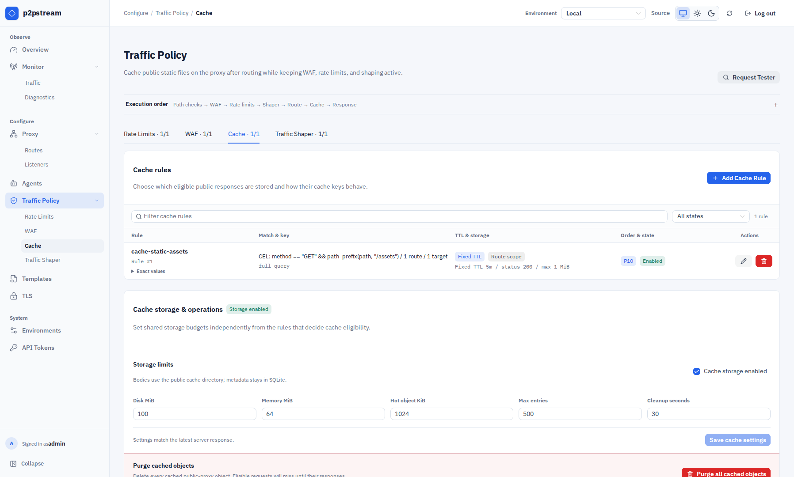
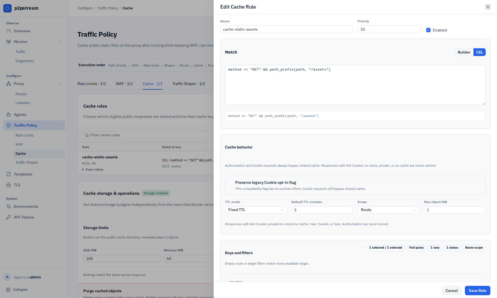

# Cache Reference

Cache rules are global public proxy policy rules for public static assets.

In the management UI, choose **Traffic Policy -> Cache**. The Cache tab keeps cache rules in a filterable table and places global **Cache storage & operations** in a separate section below it. The rule table summarizes match and key behavior, TTL and storage, priority and state, and actions; it is not combined with traffic shapers.

## Exact Fields And Defaults

Cache rules run after route/target selection and before forwarding a cache miss upstream.

| Field | Default | Description |
| --- | --- | --- |
| `name` | operator value | Rule label. |
| `priority` | `100` in database defaults | Lower numbers evaluate first. |
| `enabled` | `true` | Disabled rules are ignored. |
| `match_rule` | empty | Request-only CEL match rule. Empty matches every request. |
| `route_ids` | empty | Optional route filter. |
| `target_ids` | empty | Optional route target filter. |
| `scope` | selected target | Isolate by selected target or route. |
| `ttl_mode` | `fixed` | `fixed` or `origin`. |
| `ttl_millis` | `3600000` | Rule TTL, or origin-TTL fallback. |
| `query_mode` | full query | `full`, `ignore`, `allowlist`, or `denylist`. |
| `query_params` | empty | Query names used by allowlist or denylist modes. |
| `vary_headers` | `Accept-Encoding` | Request headers included in the cache key. |
| `cache_status_codes` | `200`, `203`, `204`, `301`, `308` | Statuses that may be stored. |
| `max_object_bytes` | `104857600` | Maximum stored response size. |
| `add_cache_status_header` | false unless enabled | Adds `X-p2pstream-Cache`. |
| `allow_cookie_requests` | `false` | Legacy/deprecated. Cookie-bearing requests always bypass shared cache; this field may still appear for compatibility but has no runtime effect. |
| `allow_cookie_requests_acknowledged` | `false` | Legacy acknowledgement field retained for compatibility with `allow_cookie_requests`. |

### Storage Limits

Cached response bodies are always written to the disk cache first. SQLite stores their metadata, while the memory cache keeps optional copies of smaller bodies for faster reads. The management UI uses binary units: one KiB is 1,024 bytes and one MiB is 1,048,576 bytes.

| UI setting | Default | Meaning |
| --- | --- | --- |
| Cache storage enabled | enabled | Enables shared-cache lookup and storage. Disabling it bypasses the cache but does not delete existing disk objects; use **Purge all cached objects** to remove them. |
| Disk MiB | `1024` MiB | Target budget for the combined size of cached response bodies on disk. This does not include SQLite metadata or filesystem overhead. When cleanup observes an over-budget cache, it removes least-recently-accessed entries until the cache is within budget. |
| Memory MiB | `128` MiB | Total budget for in-memory body copies. When adding a body would exceed the budget, least-recently-used memory copies are evicted. Their disk copies remain available. |
| Hot object KiB | `256` KiB | Maximum size of one newly stored response body that may also be copied into memory. Larger eligible responses remain disk-cached. “Hot” means eligible for the RAM tier; it is not an access-frequency score, and repeated disk hits do not promote an object into memory. This value cannot exceed **Memory MiB**. |
| Max entries | `100000` | Target limit for cache records across all rules and cache-key variants. Each distinct query or configured `Vary` combination can create another entry. Cleanup removes least-recently-accessed entries when the count is over this limit. |
| Cleanup seconds | `60` seconds | Minimum interval between cleanup passes. Cleanup is demand-driven by eligible cache traffic rather than an exact background schedule. A pass removes expired entries first, then least-recently-accessed entries until both the disk and entry-count budgets are satisfied. |

**Disk MiB** and **Max entries** are cleanup budgets, not per-write admission limits, so usage can temporarily exceed them between cleanup passes. The cache rule's **Maximum object bytes** is the separate per-response admission limit: a response larger than that value is not cached at all.

For example, with **Hot object KiB** set to `256`, a cacheable 100 KiB response is stored on disk and copied into memory. A cacheable 500 KiB response is stored only on disk. Both still count toward **Disk MiB** and **Max entries**.

The disk directory is `${CONFIG_DIR}/cache/public` by default, or the value of `PUBLIC_CACHE_DIR` when configured.

The **Storage usage** panel reports cache-accounted body bytes for the disk tier, hot body copies currently retained in memory, and cache-entry count. Each meter shows used, configured limit, and remaining budget. The values update after each successful dashboard refresh (normally every five seconds while the session is active and no edit is in progress). “Remaining” means room within the configured cache budget; it is not the host filesystem's free-space measurement. Disk usage is the logical body size tracked by cache metadata, not filesystem allocation. Usage can briefly appear over a disk or entry limit until the next demand-driven cleanup pass.

## Validation Rules

p2pstream always bypasses cache for requests with `Authorization`, `Cookie`, non-GET/HEAD methods, request bodies, `Range`, and upgrades.

`allow_cookie_requests` is retained for API and database compatibility, but Cookie-bearing requests never use shared cache lookup or storage. Do not rely on this field for cache behavior.

Requests containing encoded path separators on routes that enable `allow_encoded_separators` path security always bypass shared cache. Compatibility routes can preserve encoded separators for upstreams that require them, but those ambiguous request targets are not used for shared cache lookup or storage.

p2pstream refuses to store responses with `Set-Cookie`, `Cache-Control: no-store`, `private`, or `no-cache`, including parameterized directives such as `private="Set-Cookie"`, `Vary: *`, `Vary: Cookie`, `Vary: Authorization`, generated forwarding-header Vary values, disallowed status codes, or bodies larger than the rule limit.

Configured Vary headers cannot be `Cookie`, `Authorization`, `Set-Cookie`, `Forwarded`, `X-Forwarded-For`, `X-Forwarded-Host`, `X-Forwarded-Proto`, `X-Forwarded-Port`, or `X-Real-IP`.

Public cache entries are keyed on p2pstream's canonical request identity. Generated forwarding headers are rebuilt before upstream forwarding and are not valid shared-cache Vary dimensions.

Cache rule matches inspect only request data through CEL `match_rule` rules. Empty match rules match every request. See [CEL Policy Matching](./cel) for variables, helper functions, builder behavior, limits, and examples.

Route data, target data, target health, and load-balancer state are not available inside cache match CEL. Cache-specific `route_ids` and `target_ids` remain separate filters evaluated after route/target selection.

<figure class="doc-screenshot">
  
  <figcaption>Global cache settings control shared storage budgets and cleanup cadence; cache rules decide whether a given public response is eligible for that storage. Save pending storage changes before navigating away, and treat “Purge all cached objects” as a separate destructive operation.</figcaption>
</figure>

<figure class="doc-screenshot">
  
  <figcaption>The cache rule drawer keeps match criteria separate from post-routing filters and storage controls, which helps avoid accidentally caching dynamic or user-specific responses.</figcaption>
</figure>

## Runtime Effects

Request order:

1. ACME HTTP challenge bypass
2. Reserved WAF endpoints
3. Route-only path security match
4. WAF evaluation
5. Rate limits
6. Traffic shaper selection
7. Route/target resolution
8. Cache rule evaluation and lookup
9. Cache hit response, or upstream forwarding and cache store
10. Final response

Cache hits still consume rate-limit buckets and still use traffic shaping. Redirect routes and static targets are not cached. `HEAD` requests can be served from a cached `GET` object, but `HEAD` does not create a new cache object.

Cache statuses in traces and events:

| Status | Meaning |
| --- | --- |
| `hit` | A valid cached object was served. |
| `miss` | A rule matched, no valid object was available, and the request was forwarded upstream. |
| `bypass` | Cache was skipped because a safety rule or request condition prevented lookup/store. |
| `expired` | A matching entry existed but was expired, so the request was forwarded upstream. |
| `stored` | A complete upstream response was committed to cache. |
| `store_failed` | p2pstream attempted to capture a miss response but did not commit it. |

## Examples

Static asset suffixes:

```text
.css
.js
.png
.jpg
.jpeg
.webp
.svg
.woff2
```

Nuxt-style rule:

```text
Host: app.example.com
Path prefix: /_nuxt/
Path suffixes: .js, .css, .png, .webp, .svg, .woff2
TTL mode: Origin TTL
Cookie requests: always bypass shared cache
```

## Related Tasks

- [Public asset cache](../concepts/cache)
- [CEL Policy Matching](./cel)
- [Trace live traffic](../guides/trace-live-traffic)
- [Troubleshooting cache misses](../operations/troubleshooting#static-asset-is-not-cached)
