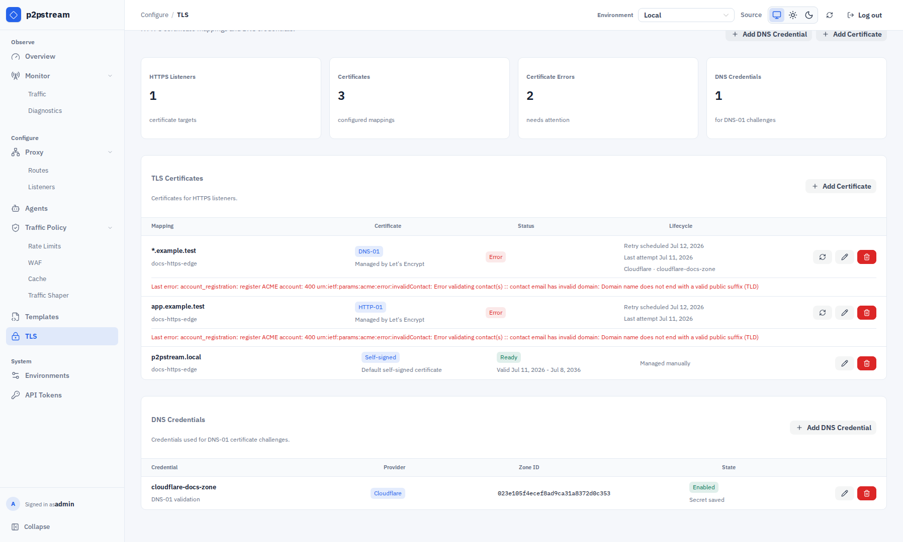
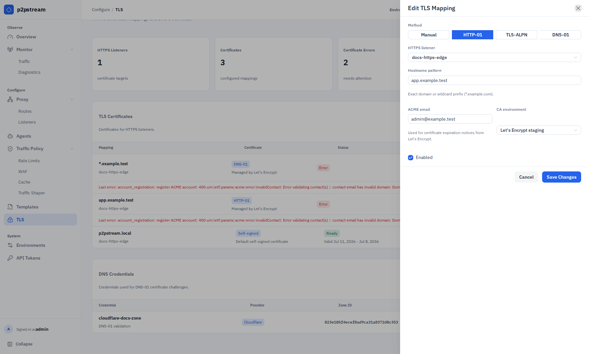
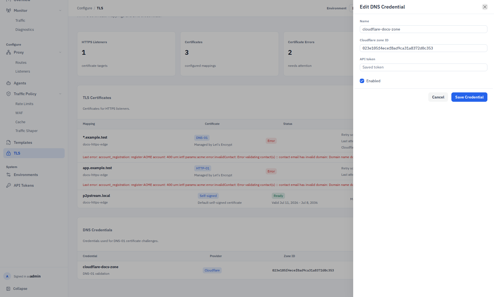
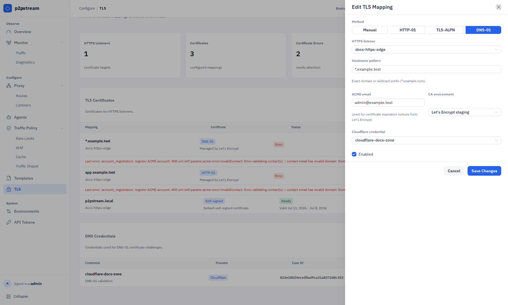

# Public TLS and ACME Reference

Public TLS is configured per HTTPS listener with certificate mappings.

In the management UI, choose **TLS** under **Configure**. Create an HTTPS listener under **Proxy -> Listeners** first, then choose **Add Certificate**. The TLS page separates certificate mappings from reusable DNS credentials and shows summary counts for HTTPS listeners, mappings, certificate errors, and DNS credentials.

## Exact Fields And Defaults

Mappings include:

- listener,
- hostname pattern,
- source,
- certificate/key material or ACME settings,
- enabled flag,
- status and renewal timestamps.

Hostname patterns support exact names and wildcards such as `*.example.com`.

The management UI's Manual method accepts uploaded PEM certificate/key material or generates a self-signed certificate. The management API also supports server file paths. ACME methods support:

| Setting | Values |
| --- | --- |
| Challenge | HTTP-01, TLS-ALPN-01, DNS-01 |
| CA | Let's Encrypt production or staging |
| DNS provider | Cloudflare for DNS-01 |

Statuses:

| Status | Meaning |
| --- | --- |
| Pending | Waiting for initial issuance. |
| Renewing | Issuance or renewal is running. |
| Ready | Certificate material is available. |
| Error | Last issuance attempt failed; check `last_error` and the next retry time. |

## Validation Rules

- ACME hostnames must be public fully-qualified DNS names.
- ACME does not accept `localhost`, `p2pstream.local`, IP addresses, or internal-only names.
- Wildcard ACME certificates require DNS-01.
- DNS-01 currently requires an enabled Cloudflare DNS credential.
- Uploaded manual certificates require both PEM certificate and key.
- Manual file-path certificates require both paths.

## Runtime Effects

Uploaded and generated public certificate material is written under `${CONFIG_DIR}/certs/public-listener-<listener-id>/`. ACME certificates renew when missing, expired, or within 30 days of expiry. Failed renewals are retried after 1 hour.

For ready ACME certificates, `next_renewal_at` is the next planned renewal time. For failed ACME certificates, `next_renewal_at` is the next automatic retry time. While a renewal is running, the next schedule is cleared until the attempt succeeds or fails.

The certificate table uses **Mapping**, **Certificate**, **Status**, and **Lifecycle** columns. It shows validity when metadata is stored or the certificate file can be parsed. For ACME certificates it also shows the last attempt time, the next renewal or retry time, the DNS credential when applicable, and the last error. Row actions renew ACME certificates, edit mappings, or delete mappings. The separate DNS Credentials table shows provider, zone ID, enabled/disabled state, and whether the secret is saved.

Server logs for ACME use `component=public_acme`. Renewal entries include fields such as `cert_id`, `listener_id`, `hostname`, `challenge_type`, `ca`, `trigger`, `stage`, `attempt_at`, `duration`, `expires_at`, `next_renewal_at`, and `retry_at`. Challenge tokens, DNS TXT values, DNS API tokens, and private key material are not logged.

<figure class="doc-screenshot">
  
  <figcaption>The TLS page is the operational view for ACME status, manual certificate mappings, DNS credentials, renewal details, and certificate errors that need attention.</figcaption>
</figure>

## Examples

HTTP-01 mapping:

```text
Listener: public-https
Hostname pattern: app.example.com
Method: HTTP-01
CA: Let's Encrypt staging, then production
```

DNS-01 wildcard mapping:

```text
Listener: public-https
Hostname pattern: *.example.com
Method: DNS-01
DNS credential: cloudflare-example
```

<figure class="doc-screenshot">
  
  <figcaption>The HTTP-01 and TLS-ALPN mapping form selects the listener, hostname pattern, ACME CA, validation method, account email, and enabled state.</figcaption>
</figure>

<figure class="doc-screenshot">
  
  <figcaption>DNS credentials are stored separately from certificate mappings so multiple DNS-01 mappings can reuse the same Cloudflare zone credential without exposing a saved secret in the UI.</figcaption>
</figure>

<figure class="doc-screenshot">
  
  <figcaption>The DNS-01 mapping form uses the saved Cloudflare credential and is the required ACME path for wildcard hostnames.</figcaption>
</figure>

## Related Tasks

- [ACME HTTP/TLS-ALPN](../guides/acme-http-tls-alpn)
- [ACME Cloudflare DNS](../guides/acme-cloudflare-dns)
- [TLS](../concepts/tls)
