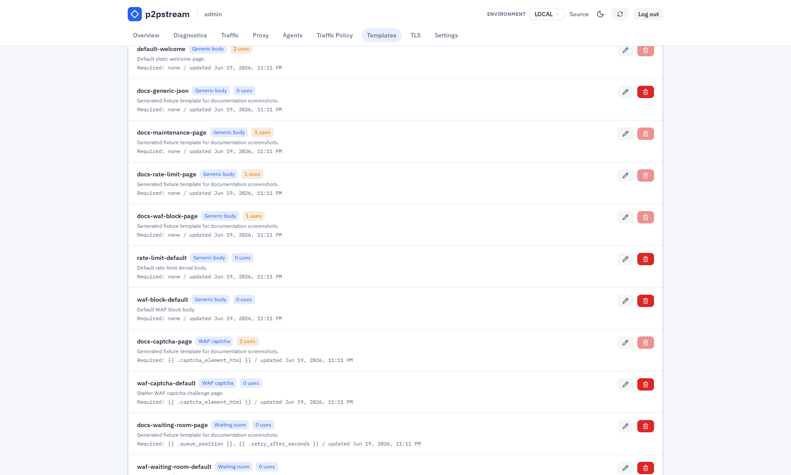
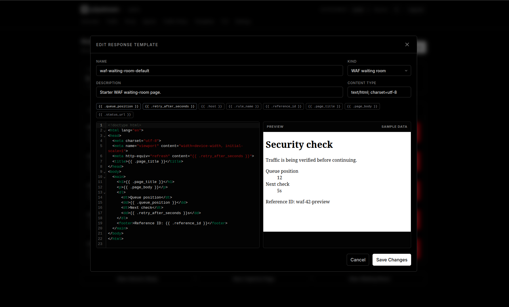

# Response Templates Reference

Response templates are centrally managed response bodies that can be reused by static route targets, rate-limit responses, and WAF responses while keeping inline bodies available for one-off cases.

## Template Kinds

| Kind | Use | Runtime behavior |
| --- | --- | --- |
| Generic body | Static target bodies, rate-limit response bodies, and WAF block bodies. | The body is reused exactly as stored. Placeholders are not rendered. |
| WAF captcha page | Full HTML page for captcha WAF rules. | Rendered with `html/template` and sample-validated on save. |
| WAF waiting room page | Full HTML page for waiting-room WAF rules. | Rendered with `html/template` and sample-validated on save. |

Generic templates only replace the body text. The object that references the template still owns the HTTP status, content type, and headers. For example, a rate-limit rule still uses its configured response status and response content type even when the body comes from a template.

## Create And Edit Templates

Open **Templates** in the management UI.

1. Choose **Add Template**.
2. Select the template kind.
3. Set a name, description, content type, and body.
4. Use the HTML editor for page templates. It includes HTML autocomplete, Emmet expansion with `Tab`, placeholder autocomplete, and a live preview with sample values.
5. Save the template, then select it from the relevant static target, rate-limit rule, or WAF rule editor.

Template names follow the same public resource name rules as listeners, routes, targets, and rules: 1 to 64 characters, starting with an alphanumeric character, using only letters, numbers, dots, dashes, and underscores.

Template kind is immutable after creation. To change a generic body into a WAF page template, create a new template of the target kind and move references to it.

<figure class="doc-screenshot">
  
  <figcaption>The Templates page shows reusable response bodies and WAF pages with their kind, content type, usage count, and whether a template can be safely edited or deleted.</figcaption>
</figure>

<figure class="doc-screenshot">
  
  <figcaption>The template editor stores generic bodies and full WAF page templates separately so each caller can enforce the right validation and runtime behavior.</figcaption>
</figure>

## Placeholders

Generic templates are raw bodies. Placeholder text such as <code v-pre>{{ .host }}</code> remains literal in generic templates.

WAF page templates support these placeholders:

| Placeholder | Required for | Description |
| --- | --- | --- |
| <code v-pre>{{ .captcha_element_html }}</code> | WAF captcha page | Server-generated captcha widget, hidden fields, and submit form. This value is trusted server HTML. |
| <code v-pre>{{ .queue_position }}</code> | WAF waiting room page | Visitor's current queue position. |
| <code v-pre>{{ .retry_after_seconds }}</code> | WAF waiting room page | Seconds until the browser should check admission again. |
| <code v-pre>{{ .host }}</code> | Optional | Request host shown to the visitor. |
| <code v-pre>{{ .rule_name }}</code> | Optional | Name of the WAF rule rendering the page. |
| <code v-pre>{{ .reference_id }}</code> | Optional | Short reference ID for support and logs. |
| <code v-pre>{{ .page_title }}</code> | Optional | Configured page title. |
| <code v-pre>{{ .page_body }}</code> | Optional | Configured page body copy. |
| <code v-pre>{{ .status_url }}</code> | Optional | Captcha verification endpoint or waiting-room status endpoint. |

Normal placeholder values are escaped by `html/template`. Only `captcha_element_html` is inserted as trusted HTML, because it is generated by the server.

<figure class="doc-screenshot">
  
  <figcaption>WAF page templates include placeholder assistance and sample rendering so required captcha or waiting-room values are present before the template can be selected by a WAF rule.</figcaption>
</figure>

## Validation Rules

On create or update, p2pstream:

- requires valid UTF-8 bodies,
- limits generic bodies to 64 KiB,
- limits WAF page templates to 128 KiB,
- parses WAF page templates with `html/template`,
- rejects unknown WAF placeholders,
- rejects missing required WAF placeholders,
- requires WAF page templates to use an HTML content type,
- executes WAF page templates with sample data to catch render errors.

Reference validation is kind-aware:

- Static targets, rate-limit rules, and WAF block responses can only select `generic_body` templates.
- Captcha WAF rules can only select `waf_captcha_page` templates for captcha pages.
- Waiting-room WAF rules can only select `waf_waiting_room_page` templates for waiting-room pages.
- Captcha page templates cannot be selected for non-captcha WAF rules.
- Waiting-room page templates cannot be selected for non-waiting-room WAF rules.

Delete a template only after removing all references to it. The UI shows usage counts and disables deletion while the template is still referenced.

## Runtime Effects

Generic body templates are resolved when the public proxy snapshot is built. If a referenced template is missing or has the wrong kind, the configuration is rejected until the reference is fixed.

WAF captcha and waiting-room page templates are rendered for each matching decision. Rendered WAF pages are served as HTML with `Cache-Control: no-store`. If a page template unexpectedly fails to render at runtime, p2pstream falls back to the built-in WAF interstitial page.

## Examples

Generic maintenance body:

```html
<!doctype html>
<html lang="en">
<head>
  <meta charset="utf-8">
  <title>Maintenance</title>
</head>
<body>
  <main>
    <h1>Maintenance in progress</h1>
    <p>Please try again soon.</p>
  </main>
</body>
</html>
```

Captcha page template:

::: v-pre

```html
<!doctype html>
<html lang="en">
<head>
  <meta charset="utf-8">
  <meta name="viewport" content="width=device-width, initial-scale=1">
  <title>{{ .page_title }}</title>
</head>
<body>
  <main>
    <h1>{{ .host }} security check</h1>
    <p>{{ .page_body }}</p>
    {{ .captcha_element_html }}
    <footer>Reference ID: {{ .reference_id }}</footer>
  </main>
</body>
</html>
```

:::

Waiting-room page template:

::: v-pre

```html
<!doctype html>
<html lang="en">
<head>
  <meta charset="utf-8">
  <meta name="viewport" content="width=device-width, initial-scale=1">
  <meta http-equiv="refresh" content="{{ .retry_after_seconds }}">
  <title>{{ .page_title }}</title>
</head>
<body>
  <main>
    <h1>{{ .page_title }}</h1>
    <p>{{ .page_body }}</p>
    <p>Queue position: {{ .queue_position }}</p>
    <p>Next check: {{ .retry_after_seconds }} seconds</p>
    <a href="{{ .status_url }}">Check status</a>
    <footer>Reference ID: {{ .reference_id }}</footer>
  </main>
</body>
</html>
```

:::

## Related Tasks

- [Redirects and static responses](../guides/redirects-and-static-responses)
- [Rate limits reference](./rate-limits)
- [WAF reference](./waf)
