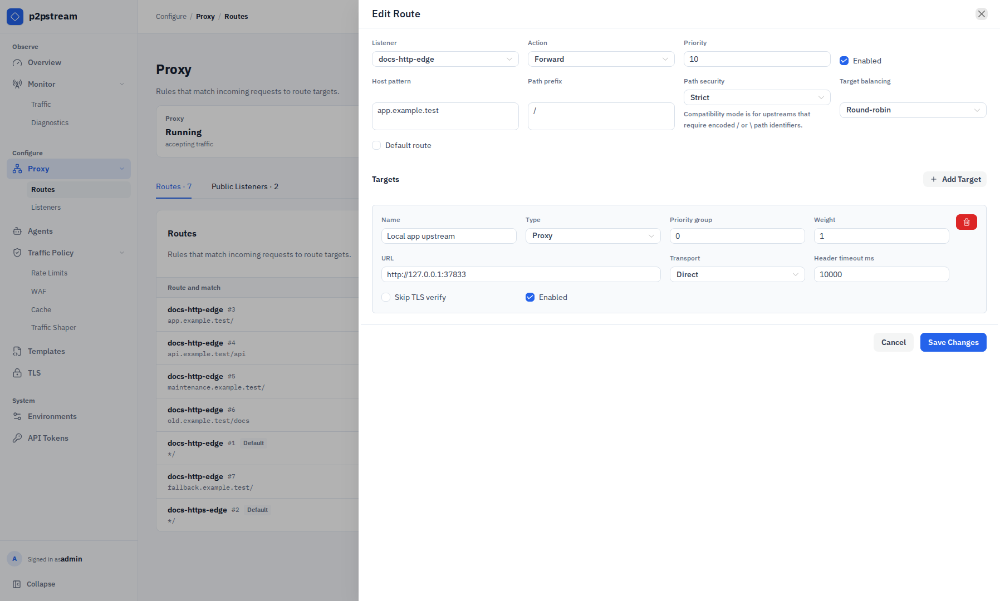
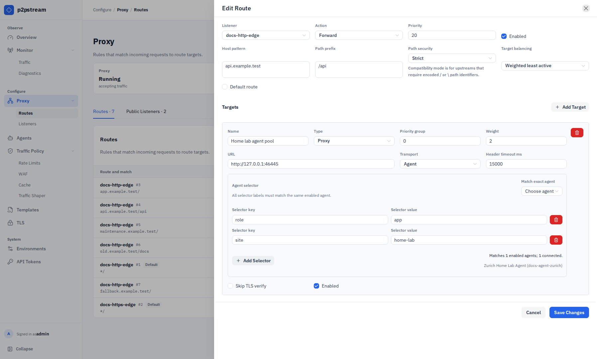
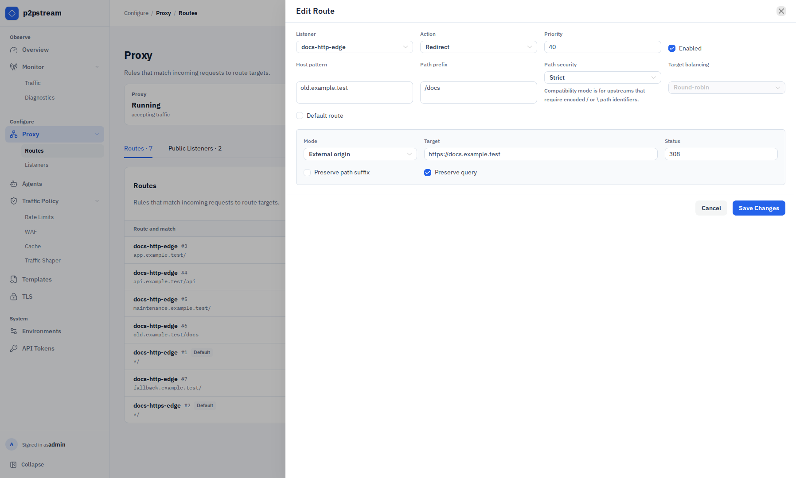
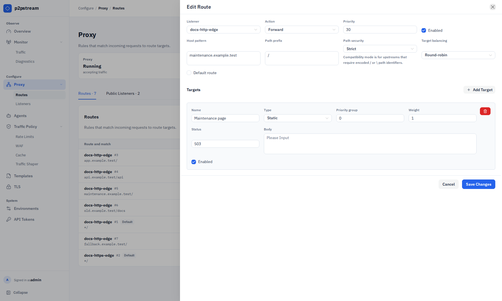

# Routing Rules Reference

Routes belong to listeners and are evaluated only for traffic received by that listener.

In the management UI, choose **Proxy -> Routes**. The Routes tab presents compact rows for route and match, action and targets, priority and state, and actions. Choose **Add Route** to open the route drawer; existing rows expose edit, clone, and delete actions. Choose **Proxy -> Listeners** to manage the incoming endpoints those routes belong to.

## Route Fields And Defaults

A non-default route requires at least one of:

- host pattern,
- path prefix.

| Field | Rule |
| --- | --- |
| `listener_id` | Required. Route is scoped to this listener. |
| `priority` | Lower numbers evaluate first. |
| `host_pattern` | Exact host or wildcard subdomain. |
| `path_prefix` | Must start with `/` when set. |
| `path_security_mode` | Defaults to `strict`. Use `allow_encoded_separators` only for upstreams that require encoded `/` or `\` path identifiers. |
| `action` | `forward` or `redirect`; defaults to forward when unspecified. |
| `target_load_balancing` | Defaults to round-robin for forward target pools. |
| `is_default` | Marks the listener default route. One default route is allowed per listener. |
| `redirect_status_code` | Defaults to `302` when unset. |
| `redirect_preserve_path_suffix` | Defaults enabled. |
| `redirect_preserve_query` | Defaults enabled. |

## Target Fields

Forward routes require at least one enabled target.

| Field | Rule |
| --- | --- |
| `target_type` | `proxy` or `static`. |
| `url` | Required for proxy targets. Must be an HTTP or HTTPS origin. |
| `transport` | `direct` or `agent` for proxy targets. |
| `agent_selector.match_labels` | Required for agent targets. All labels must match the same enabled agent. |
| `priority_group` | Lowest available group is selected; higher groups are failover. |
| `weight` | `1` to `1000000`; defaults to `100`. |
| `agent_load_balancing` | Agent selection policy for agent targets. |
| `tls_skip_verify` | Disables upstream certificate verification for this target; use only for a deliberately trusted private origin. |
| `upstream_response_header_timeout_millis` | Defaults to `60000`. |
| `upstream_request_headers` | Ordered headers added to upstream requests. Sensitive values are write-only and returned as saved-state metadata. |
| `upstream_basic_auth` | Optional upstream username and write-only password. |
| `health_check` | Optional method, path, interval, timeout, thresholds, and expected status range. |
| `static_status_code` | Local status returned by a static target. |
| `static_response_headers` | Headers returned by a static target. |
| `static_response_body_mode` | Inline body or generic response template. |
| `static_response_template_id` | Generic template selected when template mode is active. |

Static targets use `static_status_code`, `static_response_headers`, and either inline body text or a generic response template.

Agent labels are configured in the **Edit Agent** drawer. Labels under `p2pstream.io/` are system-owned. Use `p2pstream.io/agent-id=<agent public ID>` for exact-agent targeting. Empty selector values are allowed and match only agents with the same empty label value.

### Current Management UI Coverage

The route drawer currently exposes route matching, path security, route-level target balancing, redirects, and these target controls:

- target name, type, priority group, weight, and enabled state;
- proxy URL, Direct or Agent transport, response-header timeout, and TLS verification;
- exact-agent or label selectors for Agent transport;
- status and inline body for Static targets.

The management API and runtime also support upstream request headers, upstream basic authentication, health checks, per-target agent load balancing, static response headers, and template-backed static bodies. Those fields are loaded and preserved during an ordinary edit but are not currently rendered by the route drawer, so use the management API to review saved-state metadata or configure them. Secret values remain write-only. Do not infer from the drawer that an existing hidden setting is absent. Cloning a route cannot carry forward redacted header or basic-auth secrets; set new secrets through the API.

## Validation Rules

| Pattern | Matches |
| --- | --- |
| `app.example.com` | exactly `app.example.com` |
| `*.example.com` | `app.example.com`, `media.example.com` |

Wildcard patterns do not match the apex `example.com`.

Redirect routes require target mode, target, and status code `301`, `302`, `307`, or `308`.

## Path Security

Every route has a path security mode:

| Mode | Behavior |
| --- | --- |
| `strict` | Rejects request targets containing encoded path separators such as `%2F` or `%5C` before WAF, rate limits, traffic shaping, cache, or forwarding. |
| `allow_encoded_separators` | Allows encoded separators for compatibility with upstreams that use encoded path IDs, such as GitLab project paths. Shared cache bypasses encoded-separator requests on these routes. |

Decoded `.` and `..` path segments and raw literal backslashes are always rejected on public listeners. Encoded dots inside ordinary segment names, such as `/files/v1%2e2/readme`, are allowed; encoded dots that decode to a whole `.` or `..` segment are rejected.

The compatibility mode is route-scoped so only the backend that needs encoded separators receives them. WAF, rate-limit, and traffic-shaper path matching still use p2pstream's decoded request path model, so avoid relying on decoded slash boundaries for routes that enable encoded separators.

<figure class="doc-screenshot">
  
  <figcaption>The route drawer defines the listener-scoped match, path security, action, priority, and forward target pool or redirect settings.</figcaption>
</figure>

<figure class="doc-screenshot">
  
  <figcaption>Direct proxy targets are used when the p2pstream server itself can reach the upstream origin.</figcaption>
</figure>

<figure class="doc-screenshot">
  
  <figcaption>Agent proxy targets select a connected agent by labels and dial the origin from that agent's network.</figcaption>
</figure>

<figure class="doc-screenshot">
  
  <figcaption>Redirect routes return a local redirect response without selecting a route target.</figcaption>
</figure>

<figure class="doc-screenshot">
  
  <figcaption>Static response targets can return a local status, headers, and inline or template-backed body without forwarding upstream. The current drawer exposes status and inline body; configure response headers or a generic response template through the management API.</figcaption>
</figure>

## Runtime Effects

Routes are sorted by priority ascending, then route ID ascending. If no enabled non-default route matches, the listener default route handles the request.

p2pstream performs a lightweight route match before WAF, rate limits, and traffic shapers only to determine the matched route's path security mode. Target selection and load-balancer accounting still happen after those policy layers.

At request time, disabled targets, unhealthy targets, invalid target configs, and unavailable agent selector matches are skipped. p2pstream selects from the lowest available priority group. If no target is usable, the response is `503`.

When target health checks are enabled, connection and timeout failures mark the selected target or target-agent path temporarily unhealthy for later requests. The original request is not replayed to another target.

After a route and target are selected, cache rules may serve eligible proxy `GET` or `HEAD` requests. Redirect routes and static targets are not cached.

## Example

Specific route before broad fallback:

| Priority | Host | Path | Target |
| --- | --- | --- | --- |
| `10` | `app.example.com` | `/api` | `api-direct` |
| `20` | `app.example.com` | `/` | `app-agent` |
| default | empty | `/` | `welcome-static` |

## Related Tasks

- [Publish a service](../guides/publish-a-service)
- [Redirects and static responses](../guides/redirects-and-static-responses)
- [Troubleshooting route matching](../operations/troubleshooting#route-does-not-match)
