# Screenshots

A visual reference for the current p2pstream management console. These images are documentation assets under `docs/assets/new/` and are used throughout the docs where they clarify the current UI.

## Overview And Traffic

  <figure class="doc-screenshot screenshot-tile">
    
    <figcaption>First login setup</figcaption>
  </figure>

  <figure class="doc-screenshot screenshot-tile">
    
    <figcaption>Login page</figcaption>
  </figure>

  <figure class="doc-screenshot screenshot-tile">
    
    <figcaption>Overview dashboard</figcaption>
  </figure>

  <figure class="doc-screenshot screenshot-tile">
    
    <figcaption>Live traffic diagram</figcaption>
  </figure>

  <figure class="doc-screenshot screenshot-tile">
    
    <figcaption>Trace request details</figcaption>
  </figure>

## Proxy Configuration

  <figure class="doc-screenshot screenshot-tile">
    
    <figcaption>Listeners list</figcaption>
  </figure>

  <figure class="doc-screenshot screenshot-tile">
    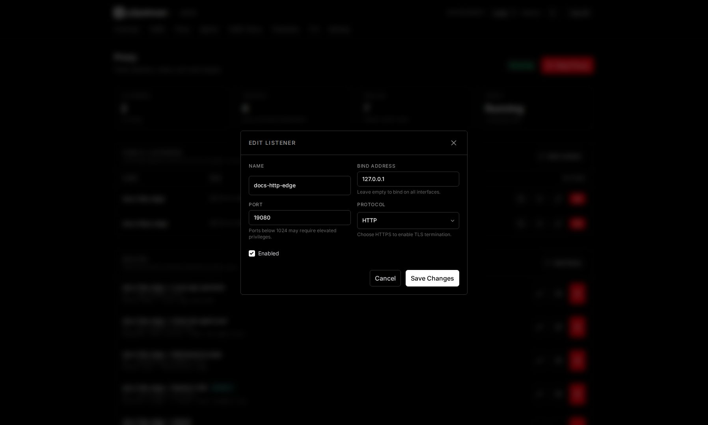
    <figcaption>Listener editor</figcaption>
  </figure>

  <figure class="doc-screenshot screenshot-tile">
    
    <figcaption>Routes and targets</figcaption>
  </figure>

  <figure class="doc-screenshot screenshot-tile">
    
    <figcaption>Target editor</figcaption>
  </figure>

  <figure class="doc-screenshot screenshot-tile">
    
    <figcaption>Route editor</figcaption>
  </figure>

  <figure class="doc-screenshot screenshot-tile">
    
    <figcaption>Direct route target</figcaption>
  </figure>

  <figure class="doc-screenshot screenshot-tile">
    
    <figcaption>Agent route target</figcaption>
  </figure>

  <figure class="doc-screenshot screenshot-tile">
    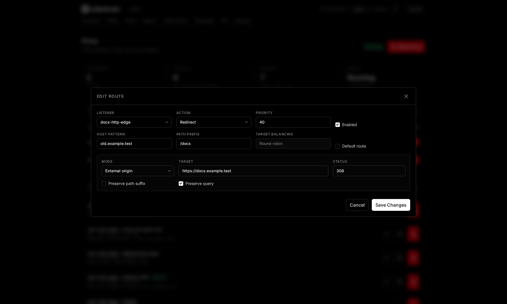
    <figcaption>Redirect route</figcaption>
  </figure>

  <figure class="doc-screenshot screenshot-tile">
    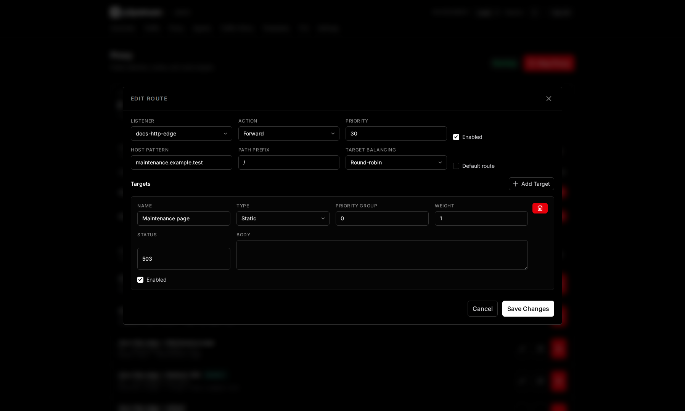
    <figcaption>Static response target</figcaption>
  </figure>

## Agents

  <figure class="doc-screenshot screenshot-tile">
    
    <figcaption>Agents page</figcaption>
  </figure>

  <figure class="doc-screenshot screenshot-tile">
    
    <figcaption>Agent setup modal</figcaption>
  </figure>

  <figure class="doc-screenshot screenshot-tile">
    
    <figcaption>Agent labels editor</figcaption>
  </figure>

## Traffic Policies

  <figure class="doc-screenshot screenshot-tile">
    
    <figcaption>WAF and rate limits</figcaption>
  </figure>

  <figure class="doc-screenshot screenshot-tile">
    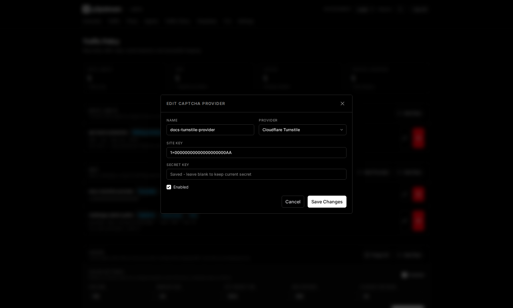
    <figcaption>Captcha provider editor</figcaption>
  </figure>

  <figure class="doc-screenshot screenshot-tile">
    
    <figcaption>WAF rule editor</figcaption>
  </figure>

  <figure class="doc-screenshot screenshot-tile">
    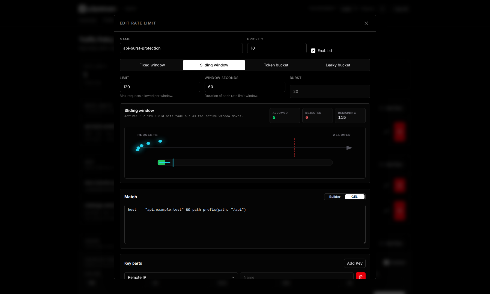
    <figcaption>Rate-limit editor</figcaption>
  </figure>

  <figure class="doc-screenshot screenshot-tile">
    
    <figcaption>Cache and shapers</figcaption>
  </figure>

  <figure class="doc-screenshot screenshot-tile">
    
    <figcaption>Cache settings</figcaption>
  </figure>

  <figure class="doc-screenshot screenshot-tile">
    
    <figcaption>Cache rule editor</figcaption>
  </figure>

  <figure class="doc-screenshot screenshot-tile">
    
    <figcaption>Traffic shaper editor</figcaption>
  </figure>

## Response Templates

  <figure class="doc-screenshot screenshot-tile">
    
    <figcaption>Templates page</figcaption>
  </figure>

  <figure class="doc-screenshot screenshot-tile">
    
    <figcaption>Template editor</figcaption>
  </figure>

  <figure class="doc-screenshot screenshot-tile">
    
    <figcaption>WAF template placeholders</figcaption>
  </figure>

## TLS

  <figure class="doc-screenshot screenshot-tile">
    
    <figcaption>TLS page</figcaption>
  </figure>

  <figure class="doc-screenshot screenshot-tile">
    
    <figcaption>ACME HTTP challenge editor</figcaption>
  </figure>

  <figure class="doc-screenshot screenshot-tile">
    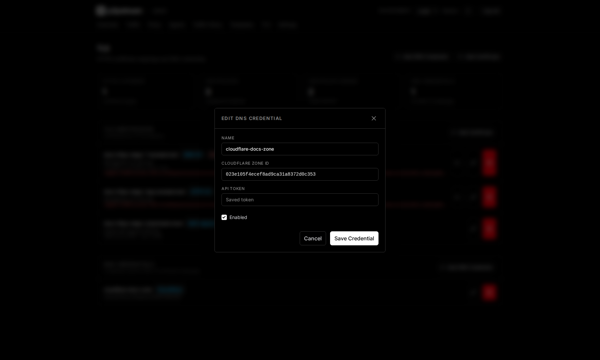
    <figcaption>DNS credential editor</figcaption>
  </figure>

  <figure class="doc-screenshot screenshot-tile">
    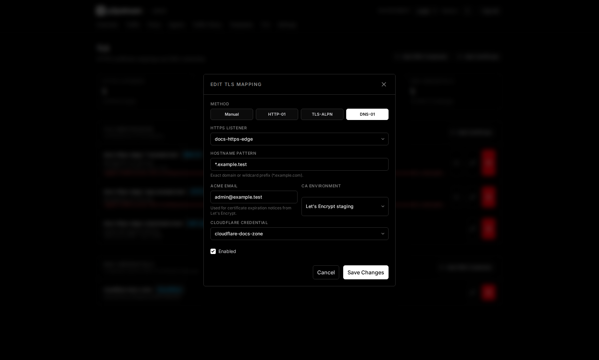
    <figcaption>ACME DNS challenge editor</figcaption>
  </figure>

## Settings And Environments

  <figure class="doc-screenshot screenshot-tile">
    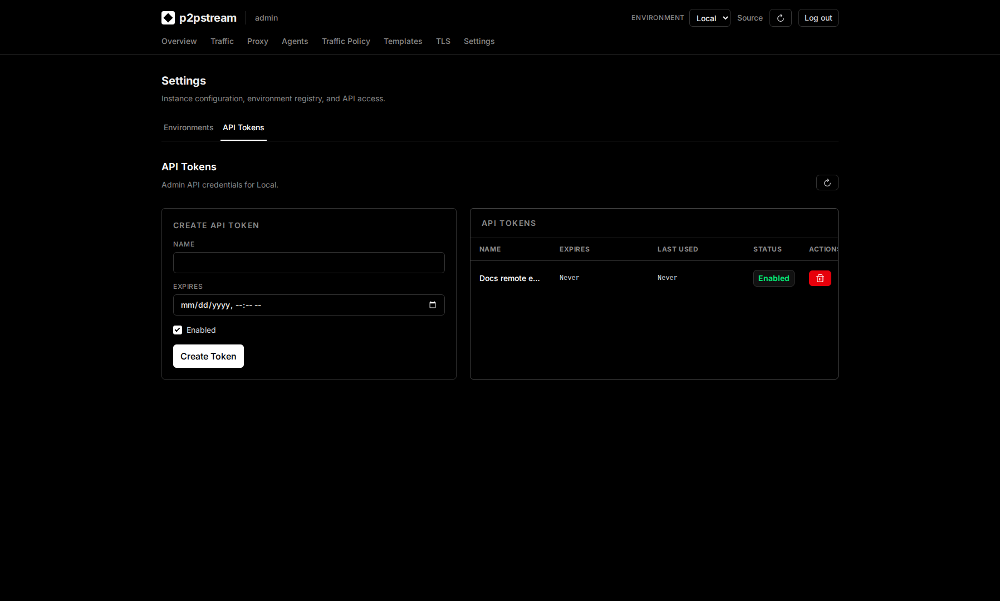
    <figcaption>API tokens</figcaption>
  </figure>

  <figure class="doc-screenshot screenshot-tile">
    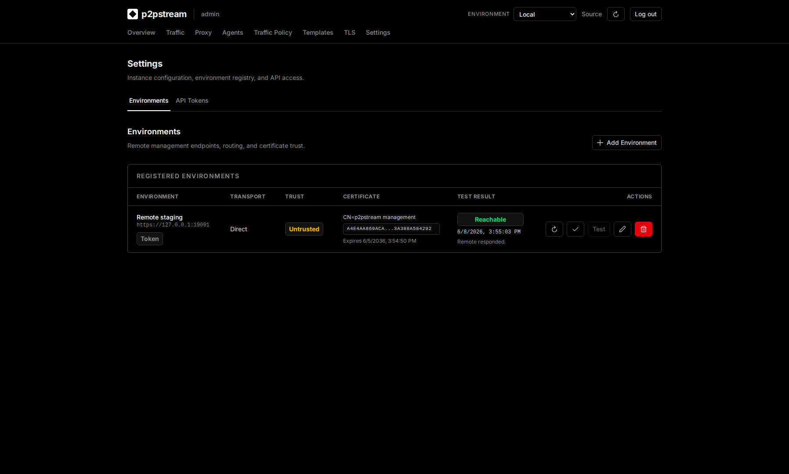
    <figcaption>Environment settings</figcaption>
  </figure>

  <figure class="doc-screenshot screenshot-tile">
    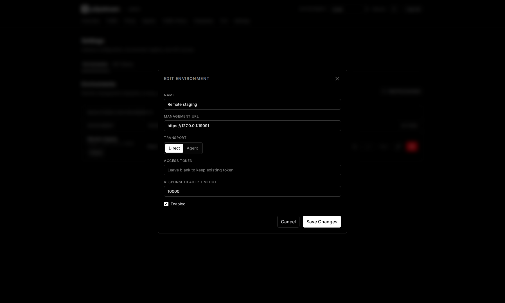
    <figcaption>Environment editor</figcaption>
  </figure>

  <figure class="doc-screenshot screenshot-tile">
    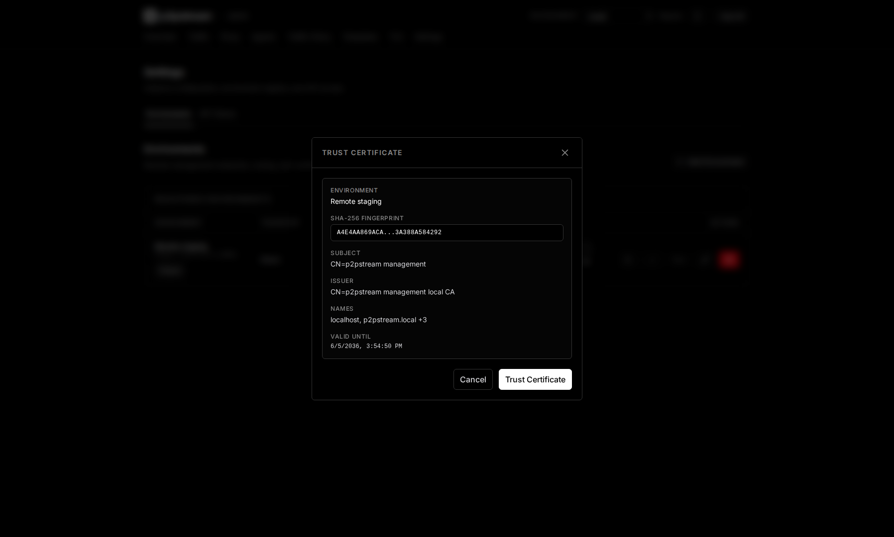
    <figcaption>Environment certificate trust</figcaption>
  </figure>

## Runtime Effects

These images are documentation assets only. They do not change product behavior and should be refreshed when the management UI layout changes.

## Related Tasks

- [First login](../getting-started/first-login)
- [Trace live traffic](../guides/trace-live-traffic)
- [Observability](../concepts/observability)
