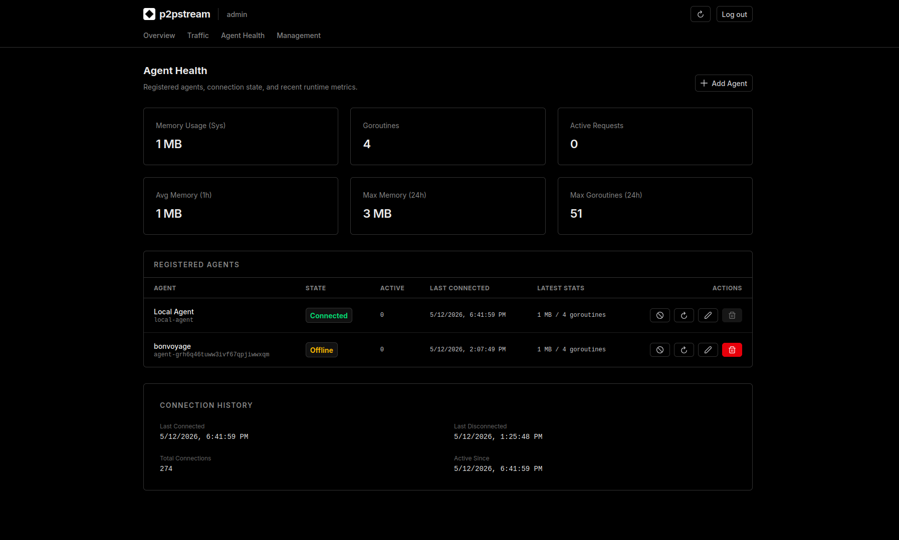
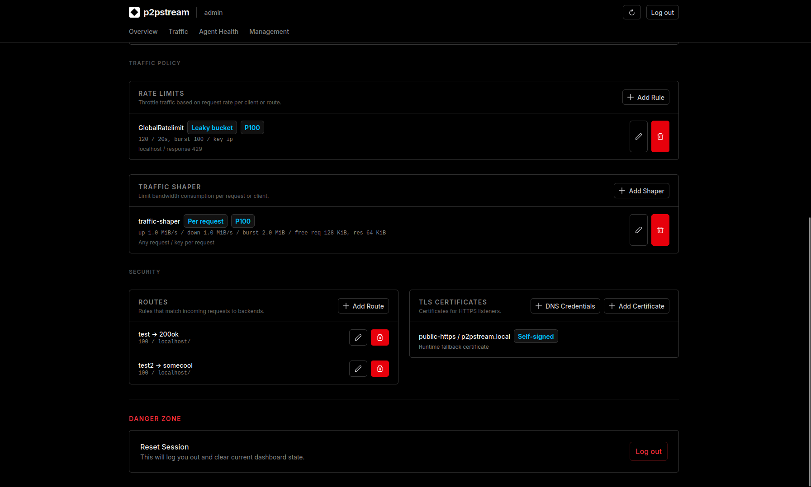

# Screenshot Overview

Use this page to quickly inspect the management console views used throughout the documentation.

## Proxy overview

<figure class="doc-screenshot">
  
  <figcaption>The Overview page summarizes proxy health, recent traffic, active agents, hot routes, and the loaded proxy configuration.</figcaption>
</figure>

## Traffic flow

<figure class="doc-screenshot">
  
  <figcaption>The Traffic page renders sampled request flow across listeners, policy checks, routes, backends, agents, upstreams, and responses.</figcaption>
</figure>

## Agent health

<figure class="doc-screenshot">
  
  <figcaption>The Agent Health page shows runtime stats, connection state, active requests, registered agents, and connection history.</figcaption>
</figure>

## Management: traffic path

<figure class="doc-screenshot">
  
  <figcaption>The Management page groups public listeners and backends so operators can define where traffic is accepted and forwarded.</figcaption>
</figure>

## Management: policy and security

<figure class="doc-screenshot">
  
  <figcaption>The lower Management sections cover rate limits, traffic shapers, routes, TLS mappings, and session controls.</figcaption>
</figure>
