# Screenshots

A visual reference for the current p2pstream management console. These images are documentation assets under `docs/assets/new/` and are used throughout the docs where they clarify the current UI.

## Overview And Monitor

  <figure class="doc-screenshot screenshot-tile">
    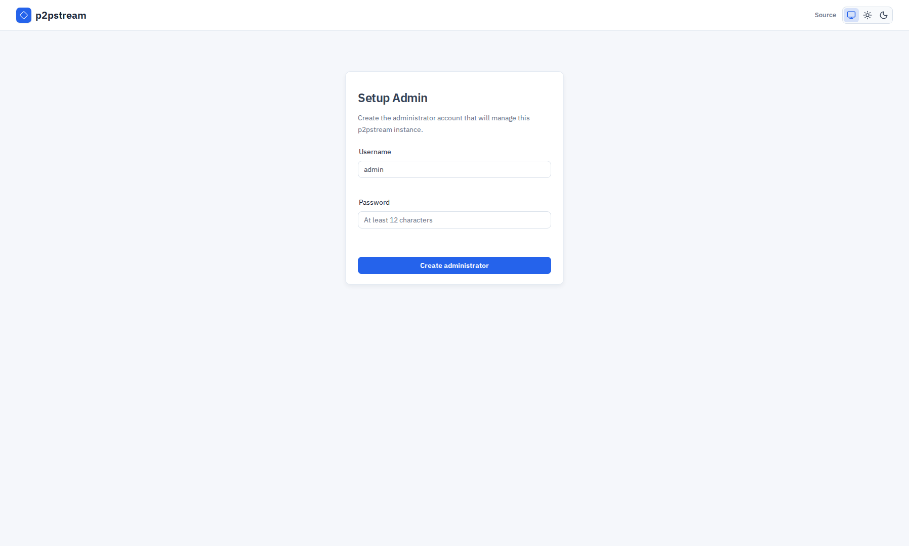
    <figcaption>First login setup</figcaption>
  </figure>

  <figure class="doc-screenshot screenshot-tile">
    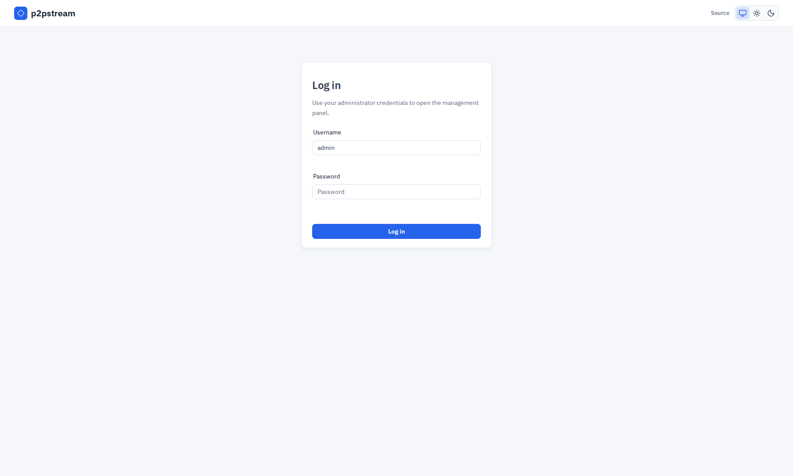
    <figcaption>Login page</figcaption>
  </figure>

  <figure class="doc-screenshot screenshot-tile">
    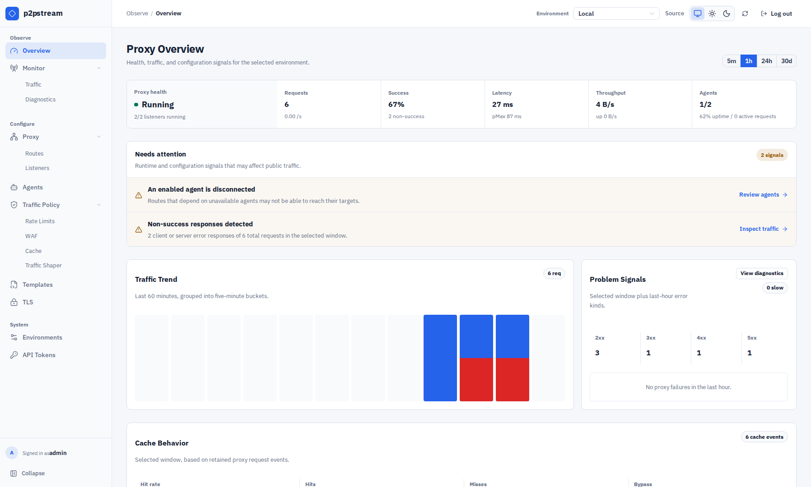
    <figcaption>Overview dashboard</figcaption>
  </figure>

  <figure class="doc-screenshot screenshot-tile">
    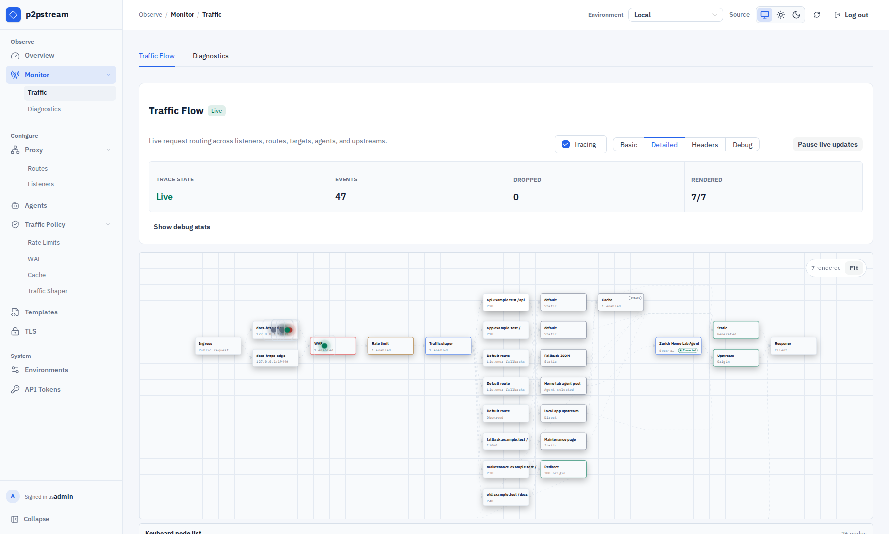
    <figcaption>Monitor traffic flow</figcaption>
  </figure>

  <figure class="doc-screenshot screenshot-tile">
    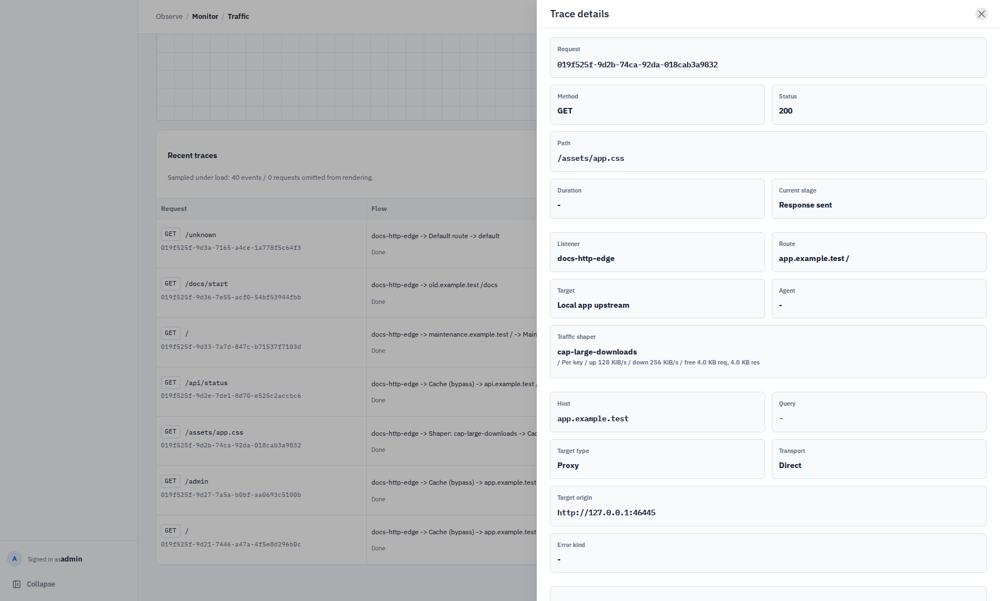
    <figcaption>Incident-first trace details drawer</figcaption>
  </figure>

## Proxy Configuration

  <figure class="doc-screenshot screenshot-tile">
    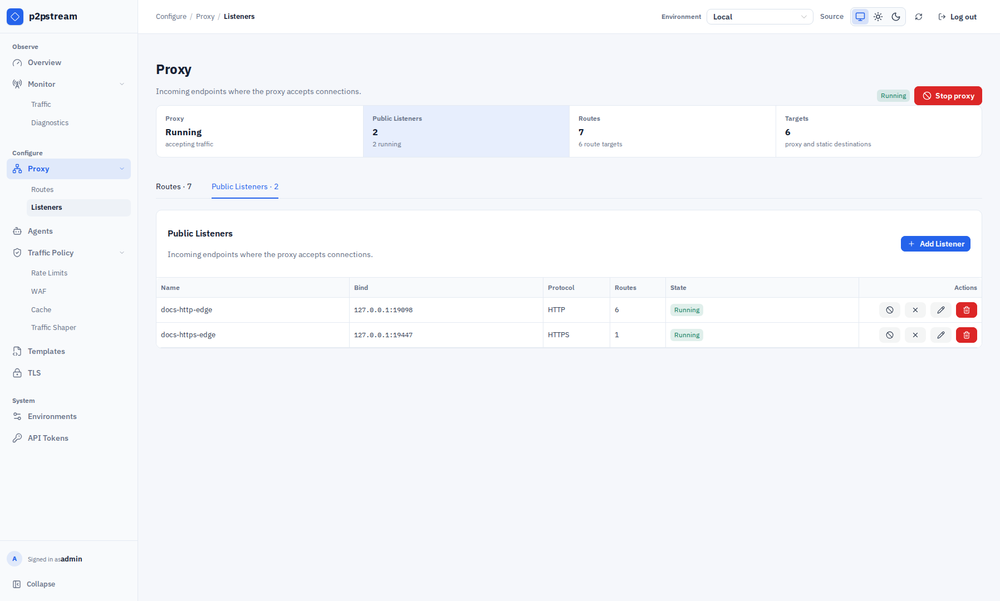
    <figcaption>Searchable public-listener table</figcaption>
  </figure>

  <figure class="doc-screenshot screenshot-tile">
    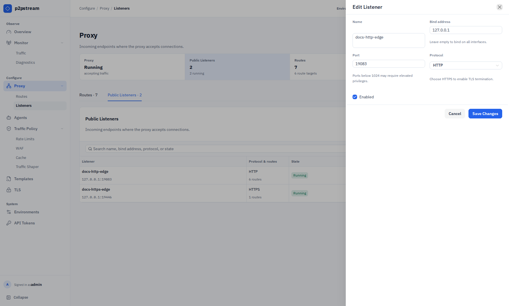
    <figcaption>Edit Listener drawer</figcaption>
  </figure>

  <figure class="doc-screenshot screenshot-tile">
    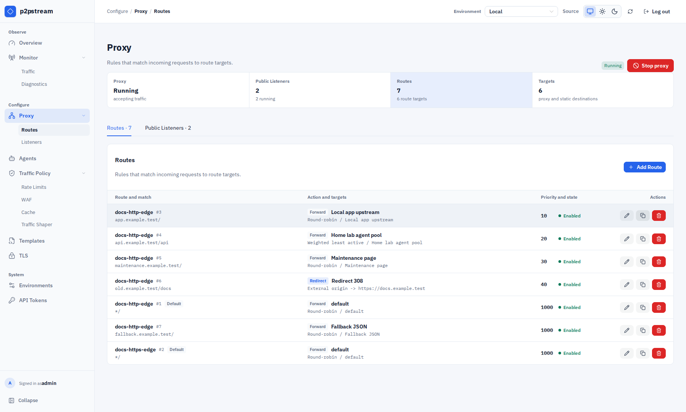
    <figcaption>Routes and targets table</figcaption>
  </figure>

  <figure class="doc-screenshot screenshot-tile">
    
    <figcaption>Direct proxy target fields</figcaption>
  </figure>

  <figure class="doc-screenshot screenshot-tile">
    
    <figcaption>Edit Route drawer</figcaption>
  </figure>

  <figure class="doc-screenshot screenshot-tile">
    
    <figcaption>Direct route target</figcaption>
  </figure>

  <figure class="doc-screenshot screenshot-tile">
    
    <figcaption>Agent route target</figcaption>
  </figure>

  <figure class="doc-screenshot screenshot-tile">
    
    <figcaption>Redirect route</figcaption>
  </figure>

  <figure class="doc-screenshot screenshot-tile">
    
    <figcaption>Static target inline-body controls</figcaption>
  </figure>

## Agents

  <figure class="doc-screenshot screenshot-tile">
    
    <figcaption>Attention-first agent fleet</figcaption>
  </figure>

  <figure class="doc-screenshot screenshot-tile">
    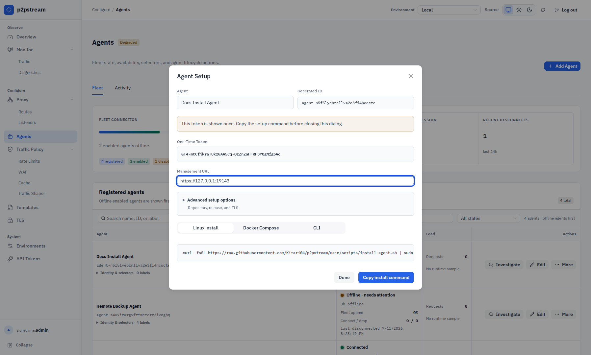
    <figcaption>One-time agent setup handoff</figcaption>
  </figure>

  <figure class="doc-screenshot screenshot-tile">
    
    <figcaption>Agent labels drawer</figcaption>
  </figure>

## Traffic Policies

  <figure class="doc-screenshot screenshot-tile">
    
    <figcaption>WAF rules, captcha providers, and visitor identity</figcaption>
  </figure>

  <figure class="doc-screenshot screenshot-tile">
    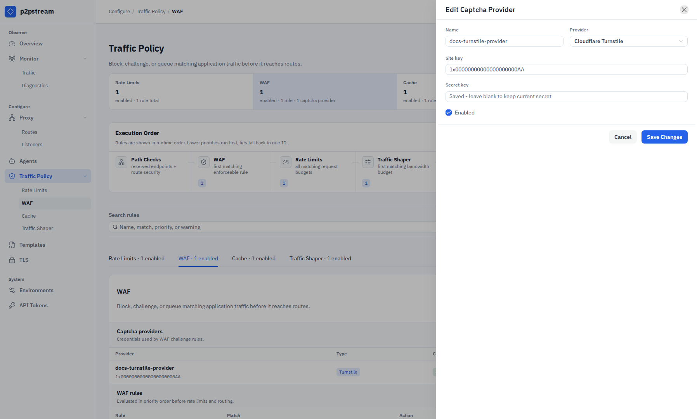
    <figcaption>Edit Captcha Provider drawer</figcaption>
  </figure>

  <figure class="doc-screenshot screenshot-tile">
    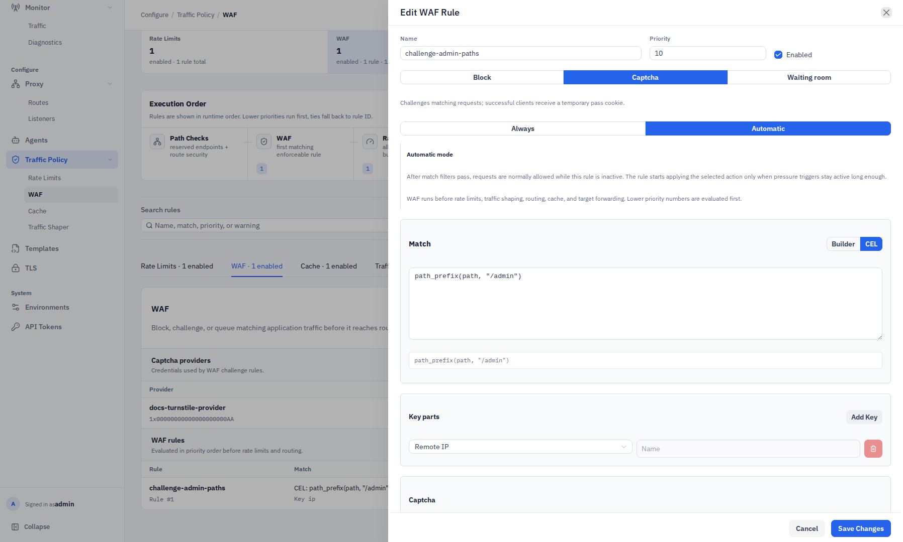
    <figcaption>WAF action, activation, match, and geographic targeting</figcaption>
  </figure>

  <figure class="doc-screenshot screenshot-tile">
    
    <figcaption>Rate-limit algorithm, budget preview, and match</figcaption>
  </figure>

  <figure class="doc-screenshot screenshot-tile">
    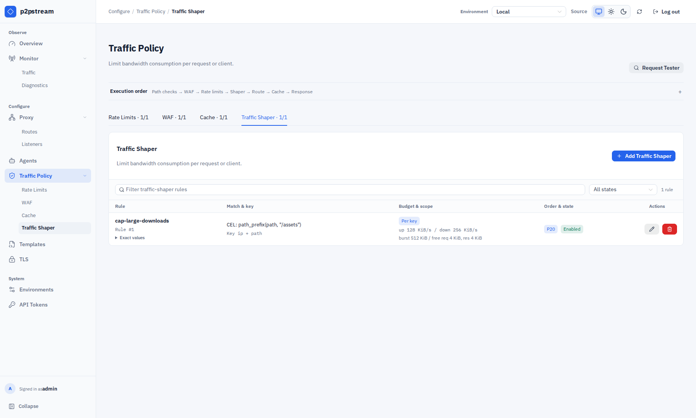
    <figcaption>Traffic Shaper tab</figcaption>
  </figure>

  <figure class="doc-screenshot screenshot-tile">
    
    <figcaption>Cache rules and storage operations</figcaption>
  </figure>

  <figure class="doc-screenshot screenshot-tile">
    
    <figcaption>Cache rule drawer</figcaption>
  </figure>

  <figure class="doc-screenshot screenshot-tile">
    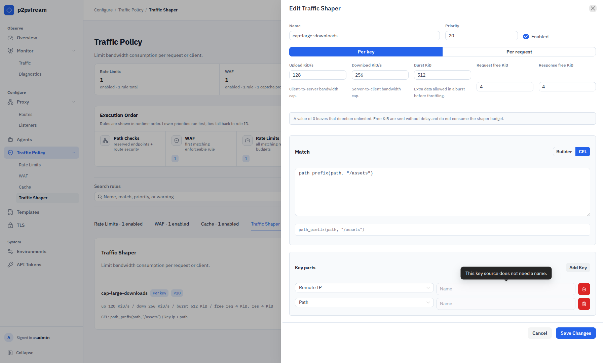
    <figcaption>Traffic shaper drawer</figcaption>
  </figure>

## Response Templates

  <figure class="doc-screenshot screenshot-tile">
    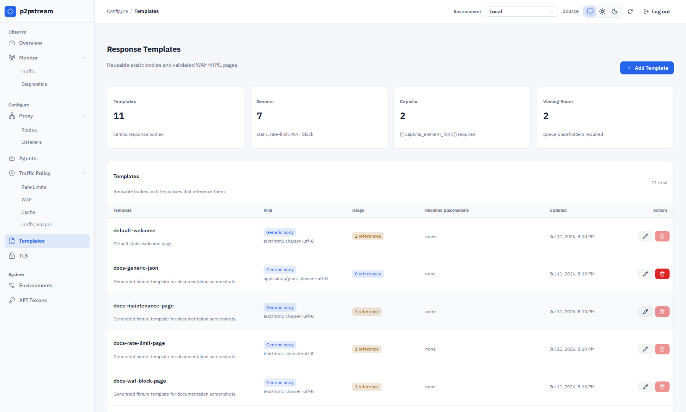
    <figcaption>Response template inventory</figcaption>
  </figure>

  <figure class="doc-screenshot screenshot-tile">
    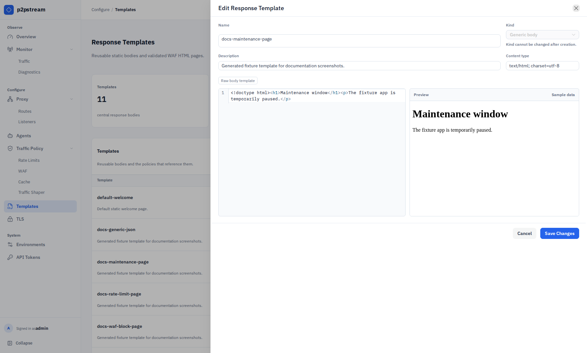
    <figcaption>Template drawer with immutable kind</figcaption>
  </figure>

  <figure class="doc-screenshot screenshot-tile">
    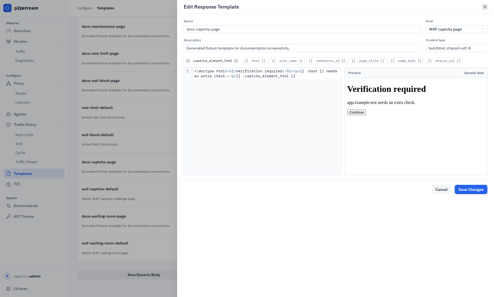
    <figcaption>WAF template placeholders</figcaption>
  </figure>

## TLS

  <figure class="doc-screenshot screenshot-tile">
    
    <figcaption>TLS certificate and DNS credential inventory</figcaption>
  </figure>

  <figure class="doc-screenshot screenshot-tile">
    
    <figcaption>Edit HTTP-01 mapping</figcaption>
  </figure>

  <figure class="doc-screenshot screenshot-tile">
    
    <figcaption>Edit DNS credential</figcaption>
  </figure>

  <figure class="doc-screenshot screenshot-tile">
    
    <figcaption>Edit DNS-01 mapping</figcaption>
  </figure>

## System Settings

  <figure class="doc-screenshot screenshot-tile">
    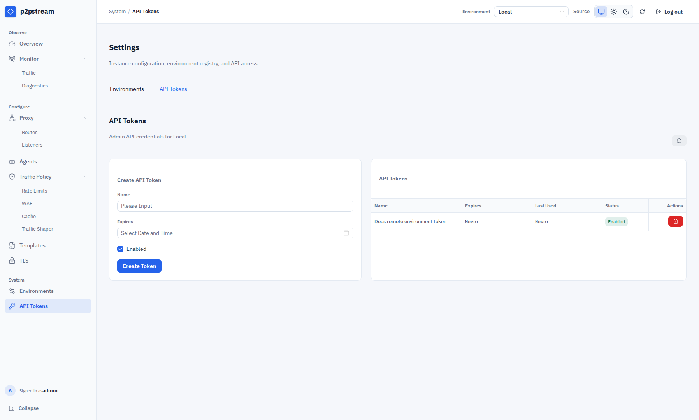
    <figcaption>Selected-environment API tokens</figcaption>
  </figure>

  <figure class="doc-screenshot screenshot-tile">
    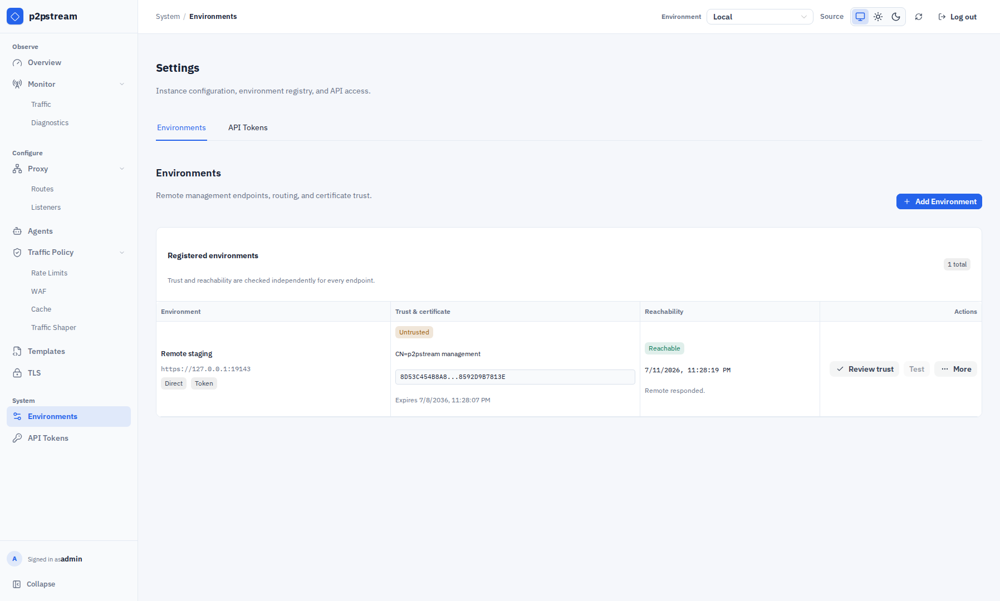
    <figcaption>Remote environment registry</figcaption>
  </figure>

  <figure class="doc-screenshot screenshot-tile">
    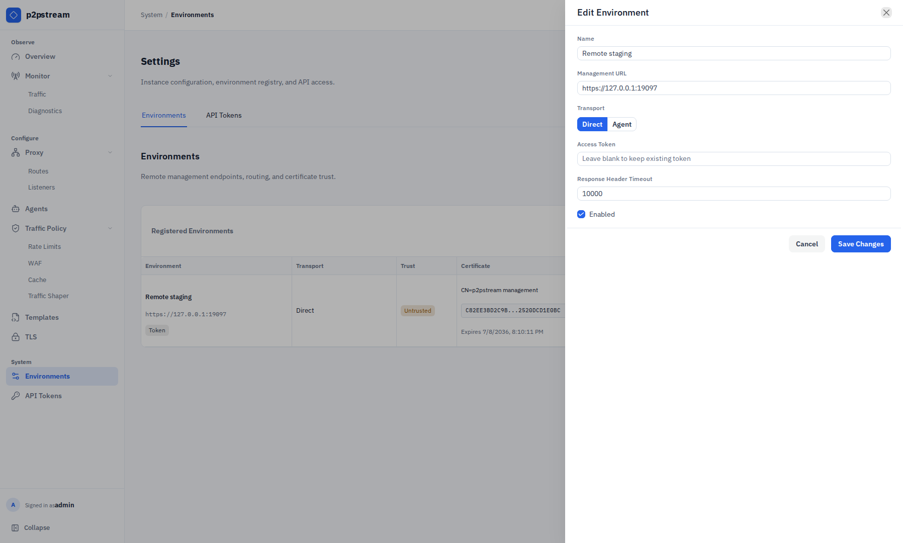
    <figcaption>Edit Environment drawer</figcaption>
  </figure>

  <figure class="doc-screenshot screenshot-tile">
    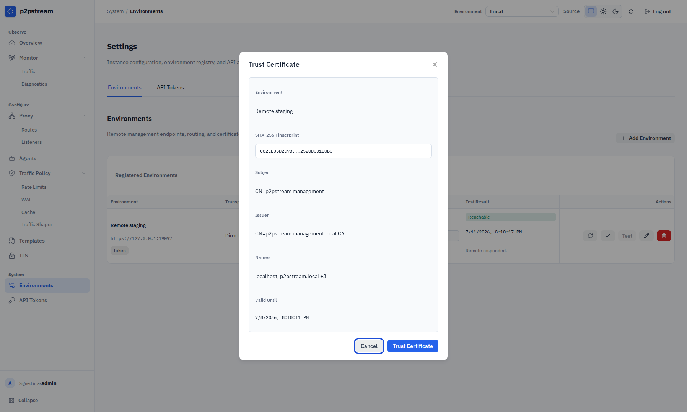
    <figcaption>Environment certificate trust</figcaption>
  </figure>

## Runtime Effects

These images are documentation assets only. They do not change product behavior and should be refreshed when the management UI layout changes.

## Related Tasks

- [First login](../getting-started/first-login)
- [Trace live traffic](../guides/trace-live-traffic)
- [Observability](../concepts/observability)
