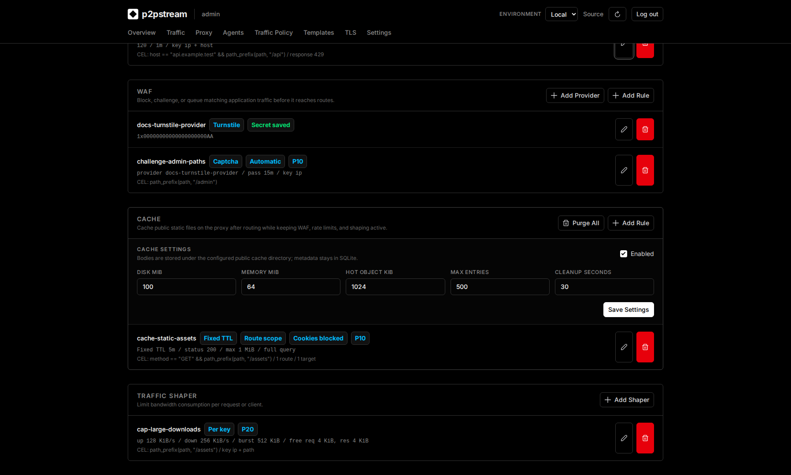
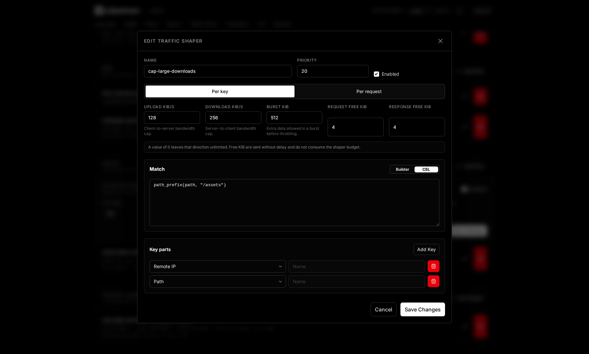

# Traffic Shaping Reference

Traffic shaper rules limit upload and/or download throughput for matching requests.

## Exact Fields And Defaults

| Setting | Default | Description |
| --- | --- | --- |
| Name | `traffic-shaper` when empty | Operator label. |
| Priority | `100` in database defaults | Lower numbers are evaluated first. |
| Budget scope | `per_key` | `per_key` or `per_request`. |
| Upload bytes per second | `0` | Request body throughput limit; `0` means unlimited. |
| Download bytes per second | `0` | Response body throughput limit; `0` means unlimited. |
| Burst bytes | `0` | Token bucket burst; defaults to the configured rate at runtime when unset. |
| Request exempt bytes | `0` | Initial request bytes sent without shaping. |
| Response exempt bytes | `0` | Initial response bytes sent without shaping. |

## Validation Rules

Traffic shapers use request-only CEL `match_rule` rules. Empty match rules match every request. See [CEL Policy Matching](./cel) for variables, helper functions, builder behavior, limits, and examples.

Route data, target data, target health, and load-balancer state are not available inside shaper match CEL. Traffic shapers still run before route resolution.

Key parts still identify the per-key budget. They can use remote IP, host, method, path, protocol, header, cookie, and query parameter values.

Byte rates and exempt bytes must be non-negative. Use realistic rates so operational debugging remains clear.

<figure class="doc-screenshot">
  
  <figcaption>The Traffic Policy page lists traffic shapers next to cache rules so admins can review streaming limits and cache behavior from the same post-routing policy area.</figcaption>
</figure>

<figure class="doc-screenshot">
  
  <figcaption>The shaper editor configures the selected stream limits and the key used to share or isolate those limits across matching requests.</figcaption>
</figure>

## Runtime Effects

Traffic shapers run after WAF and rate-limit checks and before route/target forwarding. Shaping wraps streaming request and response bodies, so very small responses may finish before the limit is noticeable.

`per_key` shares buckets for matching requests with the same key. `per_request` creates fresh buckets for each request. Editing a rule resets its in-memory buckets.

## Examples

One MiB/s public download limit:

```text
Host pattern: files.example.com
Path prefix: /download
Budget scope: per_key
Download bytes per second: 1048576
Upload bytes per second: 0
Response exempt bytes: 65536
```

## Related Tasks

- [Shape bandwidth](../guides/shape-bandwidth)
- [CEL Policy Matching](./cel)
- [Limits and shaping](../concepts/limits-and-shaping)
- [Trace live traffic](../guides/trace-live-traffic)
