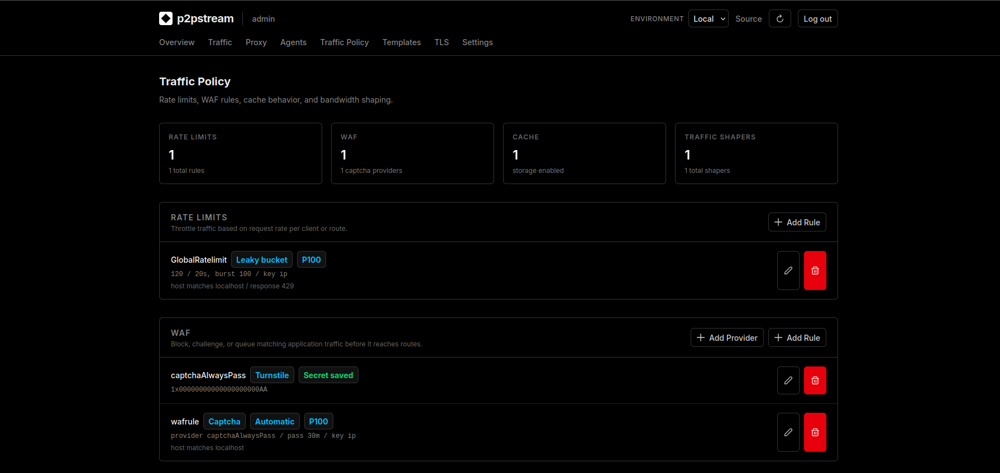
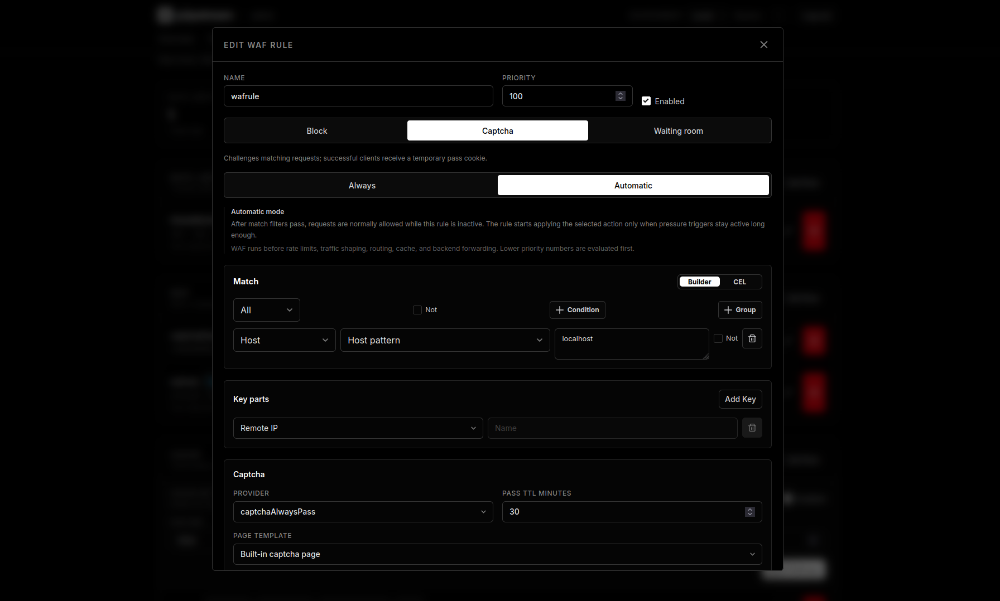

# WAF Reference

WAF rules are global public proxy rules evaluated before rate limits, traffic shapers, route resolution, and backend forwarding.

## Exact Fields And Defaults

Reserved WAF endpoints:

| Path | Use |
| --- | --- |
| `/.p2pstream/waf/captcha/verify` | Captcha form verification. |
| `/.p2pstream/waf/waiting-room` | Waiting-room page endpoint. |
| `/.p2pstream/waf/waiting-room/status` | Waiting-room status and admission check. |

ACME HTTP challenges bypass the WAF before these reserved endpoints are handled.

WAF rule defaults:

| Setting | Default or limit |
| --- | --- |
| Name | `waf-rule` when empty |
| Priority | `100` in database defaults |
| Action | Block |
| Activation mode | Always |
| Captcha pass TTL | `1800000` ms, 30 minutes |
| Captcha pass TTL range | 1 minute to 24 hours |
| Default key | remote IP |
| Block status | `403` |
| Block body source | Inline |
| Block content type | `text/plain; charset=utf-8` |
| Block body | `Request blocked\n` |
| Block body limit | 64 KiB |
| Captcha page template | None |
| Waiting-room page template | None |

Waiting-room defaults:

| Setting | Default | Range |
| --- | --- | --- |
| Max admitted sessions | `50` | 1 to 1,000,000 |
| Admission rate | `10/sec` | 1 to 100,000/sec |
| Admission session TTL | `600000` ms | 1 minute to 24 hours |
| Queue poll interval | `5000` ms | 1 to 60 seconds |
| Queue timeout | `1800000` ms | 1 minute to 24 hours |
| Page title | `Waiting room` | non-empty custom text |
| Page body | `Traffic is high. You will be admitted automatically.` | non-empty custom text |

Automatic activation defaults:

| Signal | Default |
| --- | --- |
| Request window | `10000` ms |
| Minimum request rate | `50` rps |
| Traffic spike multiplier | `4` |
| Proxy active requests | `100` |
| Backend active requests | `100` |
| Agent active requests | `50` |
| Server CPU | `85%` |
| Agent CPU | `85%` |
| Minimum active duration | `30000` ms |
| Quiet period | `60000` ms |

## Validation Rules

Captcha providers are created under **Traffic Policy -> WAF** and support Cloudflare Turnstile, hCaptcha, and Google reCAPTCHA v2 checkbox. Provider secret keys are required, stored server-side, and not sent back to the UI after creation. Captcha rules require an enabled provider.

<figure class="doc-screenshot">
  
  <figcaption>The Traffic Policy page keeps WAF rules near rate limits so admins can see which early policy layer will act before route resolution.</figcaption>
</figure>

Block response template mode requires a selected `generic_body` response template.

Captcha page templates can only be selected for captcha WAF rules. The selected template must have kind `waf_captcha_page` and include <code v-pre>{{ .captcha_element_html }}</code>.

Waiting-room page templates can only be selected for waiting-room WAF rules. The selected template must have kind `waf_waiting_room_page` and include both <code v-pre>{{ .queue_position }}</code> and <code v-pre>{{ .retry_after_seconds }}</code>.

WAF rules use request-only CEL `match_rule` rules. Empty match rules match every request. See [CEL Policy Matching](./cel) for variables, helper functions, builder behavior, limits, and examples.

Route data, backend data, backend health, and load-balancer state are not available inside WAF match CEL. WAF rules still run before route resolution.

WAF key parts reuse rate-limit key sources: remote IP, host, method, path, protocol, header, cookie, and query parameter.

Automatic trigger thresholds accept `0` to disable individual signals. CPU percentages are 0 to 100.

<figure class="doc-screenshot">
  
  <figcaption>The WAF editor combines match rules, key parts, action settings, custom responses, captcha provider selection, and waiting-room automation thresholds.</figcaption>
</figure>

## Runtime Effects

Rules are ordered by priority, then ID. The first enabled matching rule wins.

p2pstream verifies captcha tokens against the provider `siteverify` endpoint with a 3 second timeout. After success, it sets a signed `p2pstream_waf_<rule_id>` pass cookie and redirects with `303 See Other`.

Waiting-room state is in memory. Admission and queue identity are stored in signed cookies. Valid admission cookies continue to pass after restart until expiry; queue cookies are accepted after restart, but visitors are re-enqueued because FIFO state is not persisted.

Custom WAF page templates are rendered with `html/template`. Normal placeholder values are escaped. The captcha element placeholder is trusted server-generated HTML so the provider widget and form can render.

Captcha and waiting-room passes only satisfy the matching WAF rule. The request still continues through rate limits, traffic shaping, route resolution, and backend forwarding.

The original request body is never replayed after a captcha challenge or waiting-room admission.

## Examples

Login captcha rule:

```text
Action: Captcha
Host pattern: app.example.com
Path prefix: /login
Methods: POST
Key: remote IP
Captcha pass TTL: 1800000 ms
```

Automatic waiting room:

```text
Action: Waiting room
Activation mode: Automatic
Host pattern: app.example.com
Minimum request rate: 50 rps
Backend active requests: 100
```

## Related Tasks

- [WAF](../concepts/waf)
- [CEL Policy Matching](./cel)
- [Response templates reference](./response-templates)
- [Security hardening](../operations/security-hardening)
- [Troubleshooting WAF behavior](../operations/troubleshooting#waf-blocks-challenges-or-queues-unexpectedly)
